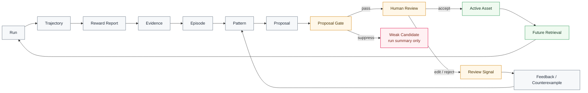
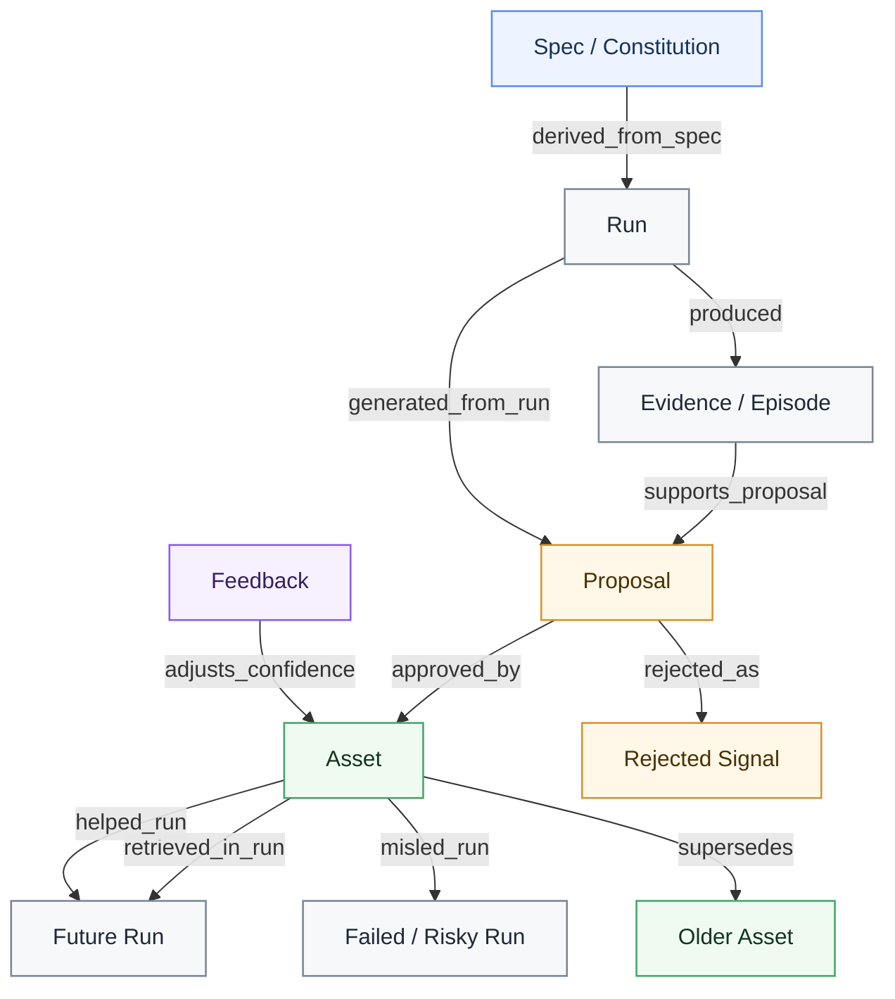

# Praxile

<div align="center">

<!-- Optional: replace this with your project logo. -->
<!--  -->

<h3>Governed experience harness for AI coding</h3>

<p>
  <b>Specs govern intent. Praxile governs experience.</b>
</p>

<p>
  Capture what coding agents actually did, turn each run into evidence-backed proposals,<br />
  and store only approved repository-local knowledge under <code>.praxile/</code>.
</p>

<p>
  <a href="./README.zh-CN.md"><b>简体中文</b></a>
  ·
  <b>English</b>
</p>

<p>
  
  
  
  
</p>

</div>

---

## What is Praxile?

**Praxile** is a governed experience harness for AI coding.

It sits around coding-agent work: it records environment interaction, builds a trajectory, computes reward and risk signals, extracts evidence, generates reviewable proposals, and writes durable repository knowledge only after human approval.

Praxile is **not** another general-purpose coding agent, **not** a hidden global memory, and **not** a Spec Kit replacement.

It is designed for teams and developers who want AI coding workflows to become more reusable over time without losing control over what the project remembers.

> Spec-driven development governs what the agent should build before execution. Praxile governs what the project should learn after execution.

---

## Why Praxile?

Most coding agents can edit files, call tools, and run tests.

But the harder problem is deciding **what should become long-term project knowledge after the run**.

| Problem | Typical coding-agent workflow | With Praxile |
|---|---|---|
| Project experience | Lost after each run | Captured as evidence-backed repository experience |
| Long-term memory | Hidden or automatic | Proposal-governed and human-approved |
| Repeated failures | Rediscovered manually | Converted into scoped failure patterns |
| Project rules | Buried in prompts | Stored as repository-local governed assets |
| Spec alignment | Checked informally | Spec context can influence reward and proposal quality |
| Silent failures | Hard to detect | Risk signals flag runs that look successful but are weakly verified |
| Explainability | Difficult to inspect | `praxile explain latest` shows retrieval, reward, and proposals |
| Governance | Manual and scattered | Audit, rollback, lifecycle status, and provenance graph |

---

## Architecture at a glance

```mermaid
flowchart LR
    classDef input fill:#EEF4FF,stroke:#5B8DEF,color:#16325C,stroke-width:1.5px;
    classDef interface fill:#F6F8FA,stroke:#7B8794,color:#1F2937,stroke-width:1.5px;
    classDef runtime fill:#F3F7FF,stroke:#4F7FD9,color:#102A56,stroke-width:1.5px;
    classDef engine fill:#F7F0FF,stroke:#8B5CF6,color:#352063,stroke-width:1.5px;
    classDef gov fill:#FFF7E8,stroke:#D8942A,color:#4A3200,stroke-width:1.5px;
    classDef asset fill:#EFFAF0,stroke:#45A66A,color:#12351F,stroke-width:1.5px;
    classDef audit fill:#F2F4F7,stroke:#667085,color:#182230,stroke-width:1.5px;

    U["User Task<br/>feedback"]:::input
    S["Spec Context<br/>spec.md · plan.md · tasks.md · constitution.md"]:::input

    U --> I["Interfaces<br/>CLI · Terminal · Gateway"]:::interface
    S --> I

    I --> R["Runtime Harness<br/>task analyzer · model router · tools · tests · safety · workspace"]:::runtime
    R --> T["Trajectory Ledger<br/>actions · observations · diffs · commands · artifacts"]:::runtime
    T --> E["Experience Engine<br/>reward · evidence · episodes · patterns"]:::engine
    E --> G["Governance Layer<br/>silent-failure signals · proposal gate · human review"]:::gov
    G --> A["Repository Assets<br/>memory · skill · rule · eval · pattern · boundary"]:::asset
    A --> Q["Future Retrieval<br/>explain · attribution · consolidation"]:::asset
    Q --> R

    G --> O["Audit & Provenance<br/>graph · redaction · CI gates · rollback"]:::audit
    A --> O
    T --> O
```



Praxile is intentionally layered:

1. **Spec and task input** describe intent and boundaries.
2. **Runtime harness** executes through controlled tools, tests, safety rules, and optional workspace isolation.
3. **Trajectory ledger** records what actually happened.
4. **Experience engine** turns the run into reward, evidence, episodes, and patterns.
5. **Governance layer** filters weak or risky learning through silent-failure detection, proposal gates, and human review.
6. **Repository assets** become durable only after approval.
7. **Audit and provenance** make the experience chain explainable and reversible.

---

## Core loop



The core rule is simple:

> A run may produce learning signals, but only approved proposals become durable repository knowledge.

---

## Feature highlights

- **Repository-local experience**  
  Memories, skills, rules, evals, failure patterns, project patterns, frozen boundaries, and architecture gates live under `.praxile/`.

- **Spec-aware execution**  
  Optional spec, plan, task, and constitution context can shape reward, silent-failure signals, and proposal gating.

- **Evidence-backed proposals**  
  Durable changes start as proposals with source runs, evidence summaries, confidence, applicability scope, anti-scope, and rollback paths.

- **Silent-failure detection**  
  Praxile flags runs that look successful but may be weakly verified, over-broad, under-specified, or poorly attributed.

- **Reward and attribution**  
  Task success, regression safety, process safety, cost, experience value, user feedback, and asset attribution are tracked separately.

- **Experience graph and audit chain**  
  Praxile builds a rebuildable local provenance graph from specs, runs, proposals, assets, feedback, and future retrieval.

- **Safety and rollback**  
  Sensitive path protection, dangerous command blocking, backups, architecture gates, workspace isolation, and proposal rollback are part of the loop.

---

## Experience graph

Praxile is not just a collection of Markdown files. It builds a local provenance graph that explains where experience came from and how it was used.



This graph is explanatory infrastructure. It helps answer:

```text
Where did this asset come from?
Which run generated this proposal?
Which evidence supported it?
Was it approved, rejected, deprecated, or superseded?
Was it retrieved in later runs?
Did it help, mislead, or become stale?
```

---

## Installation

Praxile requires **Python 3.11+**.

### Install from GitHub

```bash
pipx install "git+https://github.com/Praxile-Alpha/Praxile.git"
```

Or with `uv`:

```bash
uv tool install "git+https://github.com/Praxile-Alpha/Praxile.git"
```

### Development install

```bash
git clone https://github.com/Praxile-Alpha/Praxile.git
cd Praxile
python -m pip install -e ".[http]"
```

Optional extras:

```bash
python -m pip install -e ".[vector]"   # semantic retrieval
python -m pip install -e ".[browser]"  # browser evidence capture
python -m playwright install chromium
```

---

## Try it without a model

Run the local demo:

```bash
praxile demo --fast --accept-first --show-files
```

The demo runs locally and does not require a model endpoint. It creates a tiny project, records a trajectory, builds a reward report, generates proposals, accepts one low-risk memory inside the demo project, and shows how the next run would retrieve it.

---

## Quick start

### 1. Initialize a repository

```bash
cd /path/to/your/code-project
praxile init
praxile setup
praxile doctor
praxile doctor --online
```

`praxile setup` configures providers and model roles. Praxile stores environment variable names such as `OPENAI_API_KEY` or `OLLAMA_API_KEY`; it does not store raw API keys.

### 2. Run a task

```bash
praxile run "Fix the failing parser test" --test-command "python -m pytest"
```

### 3. Run with spec context

```bash
praxile run "Implement search API" \
  --spec docs/specs/search.md \
  --test-command "python -m pytest"
```

### 4. Review and explain

```bash
praxile review --interactive
praxile explain latest
praxile spec verify latest
```

### 5. Accept or reject proposals

```bash
praxile accept <PROPOSAL_ID>
praxile reject <PROPOSAL_ID> --reason "too broad"
```

---

## Experience model

| Layer | Purpose |
|---|---|
| Markdown / JSON | Human-readable durable assets and structured run records |
| SQLite | Asset metadata, lifecycle status, usage, and provenance |
| FTS | Keyword retrieval |
| Vector index | Optional semantic retrieval |
| Experience graph | Rebuildable provenance and impact relationships |
| Proposal history | Review, acceptance, rejection, rollback |
| Audit chain | Exportable governance evidence with redaction modes |

Approved assets are active by default. Deprecated, superseded, and archived assets stay auditable but are excluded from normal retrieval.

---

## Common commands

```text
praxile init                    Initialize .praxile in the current repository
praxile setup                   Configure providers and model roles
praxile demo --fast             Run a local governed-experience demo
praxile run "..."               Execute an agent task
praxile run "..." --dry-run     Analyze and record without editing files
praxile run "..." --spec ...    Run with spec context
praxile review --interactive    Review pending proposals
praxile explain latest          Explain retrieval, reward, and proposals
praxile spec check              Check optional spec quality signals
praxile spec verify latest      Verify a run against spec context
praxile graph explain <ASSET>   Explain asset provenance and usage
praxile audit check             Run a governance gate
praxile consolidate --all       Propose cleanup for stale or overlapping assets
praxile rollback <ID>           Roll back task edits or accepted proposals
praxile doctor --online         Validate config, routes, and local state
```

For the full CLI reference, see [Getting Started](docs/GETTING_STARTED.md).

---

## Local state

Praxile writes repository-local state under `.praxile/`:

```text
.praxile/
  config.json
  constitution.md
  memory/
  skills/
  evals/
  rules/
  experience/
    trajectories/
    evidence/
    episodes/
    patterns/
    proposals/
    feedback/
  backups/
  db/
  logs/
```

Do not put raw secrets in `.praxile/config.json`. Use environment variables through `api_key_env` and channel `token_env` settings.

---

## Interop boundary

Praxile can detect optional external-agent capabilities and can use OpenAI-compatible endpoints, but it is not a Hermes or OpenClaw plugin.

- `.praxile/memory` is not written into external global memory.
- `.praxile/skills` are not installed into external skill stores.
- Praxile trajectories are the source of truth.
- External-compatible sidecars are exports.
- Future external sync should go through explicit adapter commands and auditable proposals.

---

## Current status

Praxile is **Alpha** software.

Implemented core capabilities:

- init / setup / doctor;
- local demo;
- run / trajectory logging;
- reward report;
- evidence and proposal generation;
- proposal gate;
- review / accept / reject;
- repository-local assets;
- retrieval and explain;
- spec-aware context;
- silent-failure signals;
- experience graph and audit exports;
- rollback.

Evolving capabilities:

- isolated workspaces;
- terminal and local gateway;
- channel configuration;
- semantic judges;
- CI governance gates;
- advanced consolidation.

Not included in the first release:

- automatic model weight training;
- marketplace distribution;
- silent global memory sync;
- automatic production Telegram / Discord listeners;
- unrestricted shell execution;
- autonomous acceptance of durable experience.

---

## Documentation

- [Getting Started](docs/GETTING_STARTED.md)
- [Configuration](docs/CONFIGURATION.md)
- [Architecture](docs/ARCHITECTURE.md)
- [Core Layers](docs/CORE_LAYERS.md)
- [Experience Model](docs/EXPERIENCE_MODEL.md)
- [Why Praxile](docs/WHY_PRAXILE.md)
- [Audit Governance](docs/audit-governance.md)
- [Install And Interop](docs/INSTALL_AND_INTEROP.md)
- [Testing Guide](docs/contributing-testing.md)
- [Security Policy](SECURITY.md)

---

## Contributing

Contributions are welcome.

Good first areas:

- proposal quality and deduplication;
- spec-aware experience;
- silent-failure detection;
- retrieval quality;
- semantic judge evaluation;
- explainability;
- audit and governance UX.

Please read `CONTRIBUTING.md` and `SECURITY.md` before submitting changes.

---

## License

MIT License. See [LICENSE](LICENSE).
