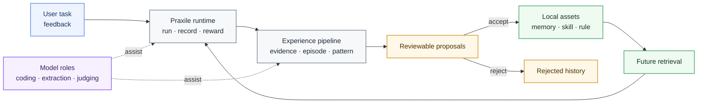
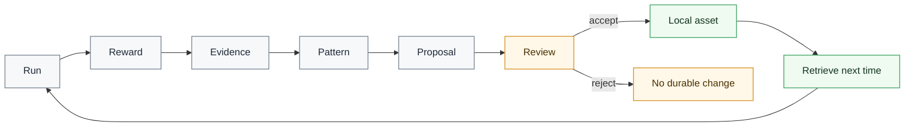

# Praxile

<div align="center">

<!-- Optional: replace this with your project logo after publishing. -->
<!--  -->

<h3>Governed local experience for coding agents</h3>

<p>
Turn coding-agent runs into <b>reviewable</b>, <b>reusable</b>, repository-local experience.
</p>

<p>
  <a href="./README.zh-CN.md"><b>简体中文</b></a>
  ·
  <b>English</b>
</p>

<p>
  
  
  
  
</p>

</div>

---

## Why Praxile?


Coding agents can fix code, run tools, and complete tasks.  
But most of what they learn during a run disappears when the run ends.

**Praxile** adds a governed experience layer to each repository:

- record how an agent run unfolded;
- extract evidence from trajectories, tool results, and user feedback;
- turn repeated lessons into reviewable proposals;
- store only approved experience under `.praxile/`;
- retrieve useful local experience in future runs.

Praxile is not a model trainer, a hidden memory system, or a fully autonomous agent.  
It is an **agent harness** for making repository-specific experience safe to keep and easy to reuse.

---

## What Praxile gives you

| Need | What Praxile adds |
|---|---|
| Reuse project knowledge | Local memories, skills, rules, and failure patterns |
| Keep control | Proposal-driven evolution; durable changes require review |
| Understand decisions | `praxile explain latest` shows loaded experience and generated proposals |
| Use feedback | Positive / negative feedback affects reward and future proposal confidence |
| Reduce model waste | Role-based model routing; local models can act as semantic judges |
| Keep data local | Repository state lives under `.praxile/` |

---

## Quick start

### 1. Install from source

```bash
git clone https://github.com/<your-org>/praxile.git
cd praxile
python -m pip install -e .
```

For development:

```bash
python -m pip install -e ".[dev]"
```

Optional extras:

```bash
python -m pip install -e ".[http]"     # HTTP gateway
python -m pip install -e ".[vector]"   # vector retrieval
python -m pip install -e ".[browser]"  # browser evidence capture
python -m playwright install chromium
```

### 2. Run the local demo

```bash
praxile demo --fast --accept-first
```

### 3. Initialize a repository

```bash
cd /path/to/your/project
praxile init
praxile setup
praxile doctor --online
```

### 4. Run a task

```bash
praxile run "Fix the failing parser test" --test-command "python -m pytest"
```

### 5. Review what Praxile learned

```bash
praxile review --interactive
praxile explain latest
```

### 6. Add feedback

```bash
praxile feedback latest --positive "Good fix. The scope was correct."
praxile feedback prop_123 --negative "This proposal is too generic."
```

---

## Architecture at a glance



---

## Core loop



---

## Main concepts

| Concept | Meaning |
|---|---|
| Trajectory | What happened during a run |
| Evidence | Structured facts extracted from a trajectory |
| Episode | A learnable slice of a run |
| Pattern | A recurring project-specific lesson |
| Proposal | A reviewable durable change |
| Asset | Approved memory, skill, rule, or failure pattern |

---

## Common commands

```text
praxile init                 Initialize .praxile in the current repository
praxile setup                Configure providers and model roles
praxile demo --fast          Run a local self-evolution demo
praxile run "..."            Execute an agent task
praxile review --interactive Review pending proposals
praxile explain latest       Explain retrieval, reward, and proposals
praxile feedback latest ...  Add explicit feedback
praxile doctor --online      Validate configuration and local state
```

---

## Local state

Praxile writes repository-local state under `.praxile/`.

```text
.praxile/
  config.json
  memory/
  skills/
  rules/
  experience/
    evidence/
    episodes/
    patterns/
    proposals/
    feedback/
  db/
  logs/
  backups/
```

---

## Safety boundaries

Praxile is designed around governed evolution.

It does:

- record trajectories;
- compute reward reports;
- extract evidence and patterns;
- generate reviewable proposals;
- retrieve approved local experience;
- incorporate explicit feedback.

It does not:

- fine-tune models;
- silently rewrite long-term memory;
- auto-approve project rules;
- export project knowledge to hidden global memory;
- replace human review.

---

## Project status

Praxile is currently **alpha**.

Available:

- repository-local experience
- proposal-driven evolution
- hybrid reward
- user feedback loop
- model roles
- semantic judges
- pattern mining
- asset lifecycle governance

Experimental:

- HTTP gateway
- browser adapter
- production hardening

---

## Documentation

Recommended next reads:

- `docs/GETTING_STARTED.md`
- `docs/ARCHITECTURE.md`
- `docs/CONFIGURATION.md`
- `docs/STATE_LAYOUT.md`
- `docs/experience-governance.md`
- `docs/proposal-decision-guide.md`

---

## Contributing

Contributions are welcome.

Good first areas:

- model-role ergonomics
- retrieval quality
- semantic-judge evaluation
- proposal review UX
- explainability
- experience governance

Please read `CONTRIBUTING.md` and `SECURITY.md` before submitting changes.

---

## License

MIT License. See [LICENSE](LICENSE).
