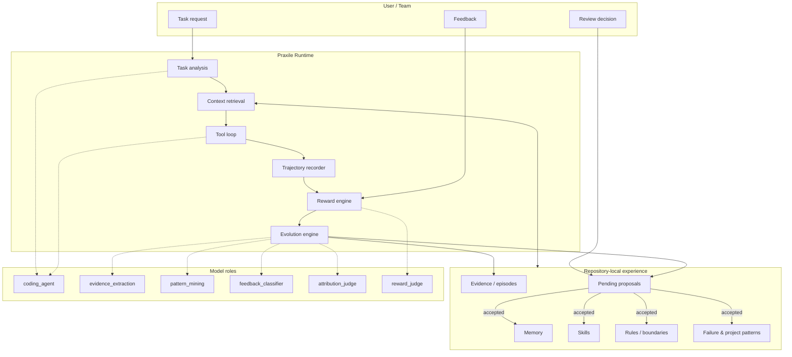
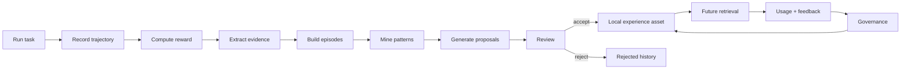
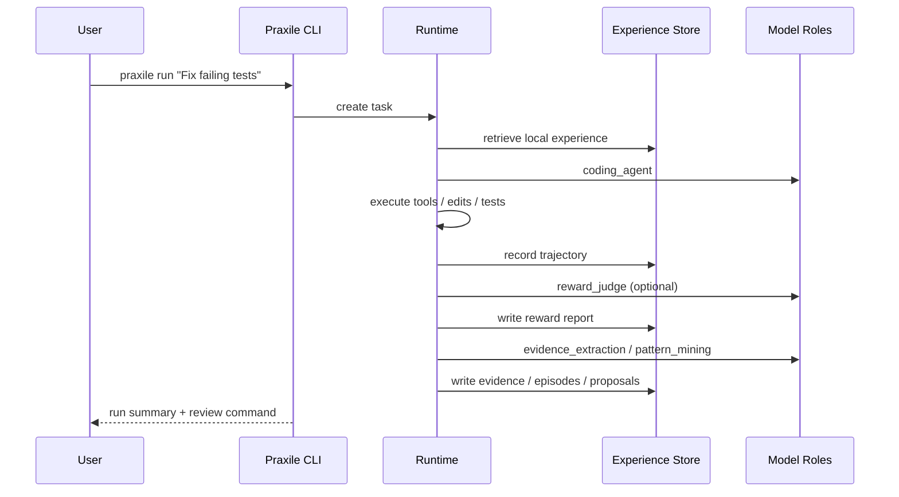
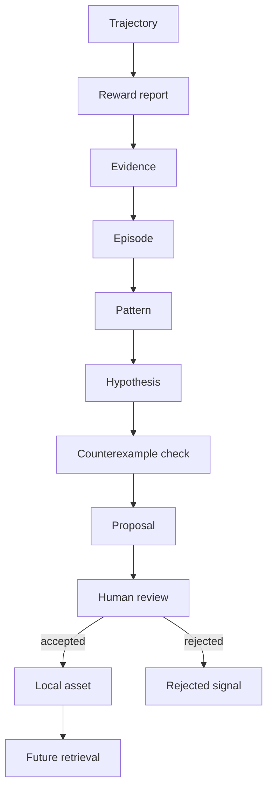
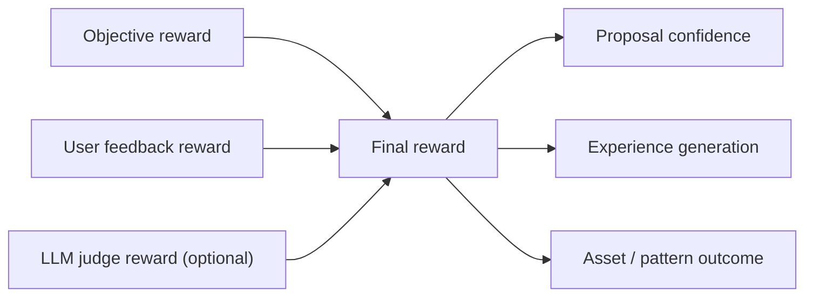
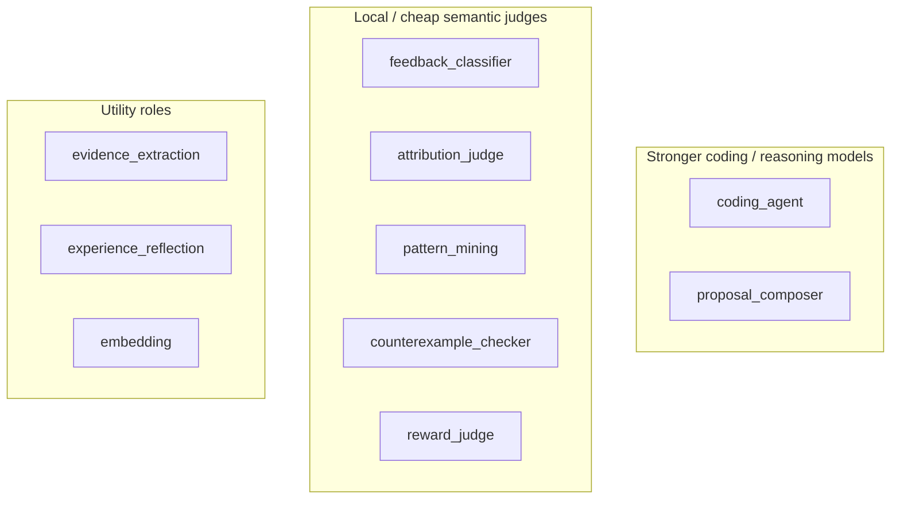
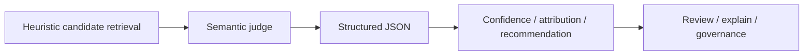
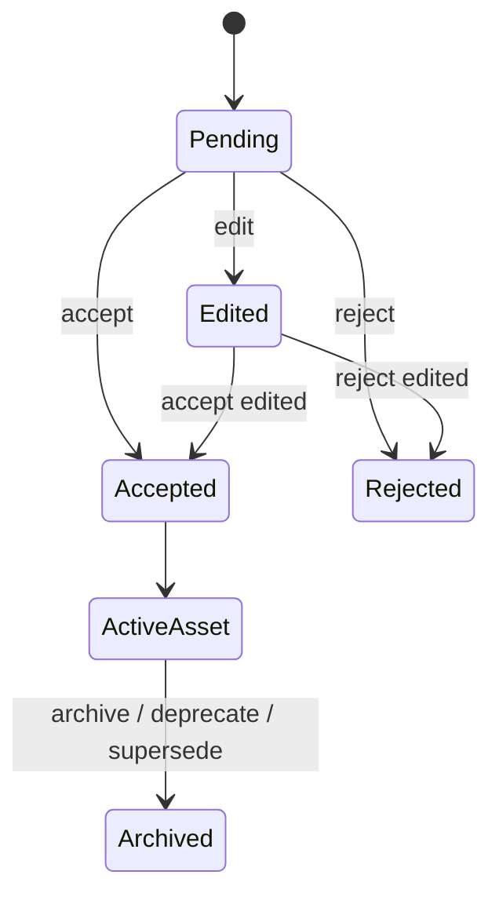
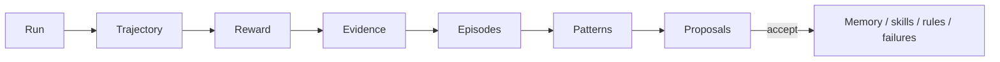

# Praxile

<div align="center">

**Governed local experience for coding agents**

Turn coding-agent runs into reviewable repository experience: evidence, patterns, proposals, feedback-aware rewards, and reusable local assets.

<br />

[](#installation)
[](LICENSE)
[](#project-status)
[](#why-praxile)
[](#model-roles)

</div>

---

## What is Praxile?

Most coding agents forget what they learned after every run.

Praxile gives each repository a **governed local experience layer**. It records how an agent run unfolded, extracts evidence and project patterns, generates reviewable proposals, incorporates user feedback as reward, and stores only the experience that you approve.

Praxile is not a model trainer. It is not a hidden memory system. It is not a fully autonomous coding agent.

It is an agent harness layer for making project experience:

- **local** — stored in the repository under `.praxile/`;
- **auditable** — backed by trajectories, reward reports, evidence, and proposals;
- **reviewable** — durable changes require user approval;
- **reusable** — accepted experience can be retrieved in future tasks;
- **governed** — stale, duplicate, harmful, or over-broad experience can be rewritten, merged, archived, or deprecated.

> Praxile is a governed, model-role-aware, feedback-aware, semantic-judge-assisted repository-local experience layer for coding agents.

---

## Why Praxile?

Coding agents are powerful, but real projects need more than one-off task execution.

Praxile is designed for teams and developers who want their agent workflows to accumulate repository-specific experience without giving up control.

| Problem | Typical coding-agent workflow | Praxile |
|---|---|---|
| Project experience | Often lost after each run | Stored as local, reviewable repository assets |
| Failure reuse | Depends on manual prompting | Failure patterns become retrievable experience |
| Architecture rules | Soft prompt instructions | Explicit boundaries, rules, and review gates |
| Feedback | Informal and discarded | Recorded as reward and governance signal |
| Memory safety | Opaque or automatic | Proposal-driven and user-approved |
| Model cost | One model often handles everything | Role-based routing, local cheap models supported |
| Explainability | Varies | `praxile explain latest` shows why experience was used |

---

## Feature highlights

- Repository-local `.praxile/` state
- Proposal-driven self-evolution
- Evidence → Episode → Pattern → Proposal pipeline
- Hybrid reward: objective signals + user feedback + optional LLM judge
- Model roles for coding, evidence extraction, feedback classification, attribution, pattern mining, reward judging, and more
- Ollama/local-model friendly semantic judges
- Asset lifecycle governance: active, deprecated, superseded, archived, reactivated
- Explicit feedback CLI for runs, proposals, assets, and patterns
- Explainable learning reports
- Optional HTTP gateway
- Optional browser evidence capture
- SQLite + FTS-backed local experience index

---

## Architecture at a glance



---

## Core loop



---

## Installation

> Praxile is currently in alpha. For the first public release, source installation is the safest path.

### Install from GitHub

```bash
git clone https://github.com/Praxile-Alpha/Praxile.git
cd Praxile
python -m pip install -e .
```

For development:

```bash
python -m pip install -e ".[dev]"
```

Optional extras:

```bash
# HTTP transport
python -m pip install -e ".[http]"

# semantic vector retrieval
python -m pip install -e ".[vector]"

# browser evidence capture
python -m pip install -e ".[browser]"
python -m playwright install chromium
```

### One-line install

```bash
curl -fsSL https://raw.githubusercontent.com/Praxile-Alpha/Praxile/main/install.sh | bash
```

A safe installer should only install Praxile and print next steps. It should not modify project state until the user runs `praxile init`.

### Verify installation

```bash
praxile --help
```

---

## Quick start

### 1. Run the demo

The fastest way to understand Praxile is to run the local demo. It does not require model configuration.

```bash
praxile demo --fast --accept-first
```

Expected shape:

```text
[1/6] Creating fast demo project
[2/6] Recording synthetic failing test
[3/6] Applying scoped fix
[4/6] Recording synthetic verification
[5/6] Generating reward and proposals
[6/6] Showing next-run retrieval evidence

Accepted demo memory proposal: prop_...
Retrieval after accept: 2 memory match(es)
```

### 2. Initialize Praxile in a repository

```bash
cd /path/to/your/project
praxile init
praxile setup
praxile doctor --online
```

### 3. Run a task

```bash
praxile run "Fix the failing parser test" --test-command "python -m pytest"
```

### 4. Review what Praxile learned

```bash
praxile review --interactive
praxile explain latest
```

### 5. Provide feedback

```bash
praxile feedback latest --positive "Good fix. The scope was correct."
praxile feedback prop_123 --negative "This proposal is too generic."
praxile feedback asset .praxile/skills/test-repair/SKILL.md --helpful
```

---

## What happens during a run?



---

## Experience evolution pipeline

Praxile does not jump directly from a task to long-term memory. It builds an auditable chain.



### Key objects

| Object | Purpose |
|---|---|
| Trajectory | What happened during the run |
| Reward report | How the run scored across objective, user, and optional judge signals |
| Evidence | Structured facts from the run |
| Episode | A learnable slice of a run |
| Pattern | Cross-run recurring behavior |
| Hypothesis | Candidate project-level learning |
| Proposal | Reviewable durable change |
| Asset | Accepted local experience |

---

## Hybrid reward

Praxile separates execution success from experience quality.



### Reward components

| Component | Examples |
|---|---|
| Objective reward | tests passed, command success, failed actions, blocked actions, safety, regression risk |
| User feedback reward | “good fix”, “too generic”, “this rule misled you” |
| LLM judge reward | optional structured quality assessment from `reward_judge` role |

Praxile can run in objective-only, objective-plus-user, or hybrid mode.

---

## Model roles

Different parts of Praxile can use different models.

This lets you reserve stronger models for coding and use local cheap models for high-frequency semantic judgment.



### Common roles

| Role | Purpose |
|---|---|
| `coding_agent` | tool loop, code edits, repair logic |
| `evidence_extraction` | convert trajectory into structured evidence |
| `experience_reflection` | summarize local lessons |
| `feedback_classifier` | parse user feedback |
| `attribution_judge` | decide whether an asset helped a run |
| `pattern_mining` | judge semantic similarity between episodes |
| `counterexample_checker` | detect semantic counterexamples |
| `reward_judge` | optional quality scoring |
| `proposal_composer` | write proposal content |
| `review_recommendation` | classify review guidance |
| `embedding` | retrieval vectorization |

---

## Semantic judges

Praxile uses semantic judges as bounded assistants.

They refine confidence, attribution, and recommendations. They do not write long-term assets directly.



### Available semantic judges

| Judge | Purpose |
|---|---|
| FeedbackSemanticClassifier | Parse complex user feedback into structured events |
| AttributionJudge | Decide whether a loaded asset likely helped the run |
| PatternSemanticJudge | Decide whether episodes share an underlying project pattern |
| CounterexampleSemanticChecker | Decide whether historical evidence weakens a hypothesis |

### Why keep heuristics?

Praxile uses heuristics first because they are fast, deterministic, and easy to audit. Local models are used for semantic refinement after the candidate set is narrowed.

---

## Proposal review

Praxile’s governance boundary is proposal review.



### Review commands

```bash
praxile review --summary
praxile review --interactive
praxile review --risk high
praxile review --type failure_pattern
praxile review --confidence high
praxile review --recommended accept
```

### Batch actions

```bash
praxile accept --all-low-risk
praxile accept --all-low-risk --yes
praxile reject --low-confidence --reason "too generic"
```

`praxile accept --all-low-risk` is a dry run by default. Add `--yes` to apply.

High-risk proposal types are never batch-accepted.

---

## Explainability

Use:

```bash
praxile explain latest
```

Praxile explains:

- why experience was loaded;
- what the run learned;
- which proposals were produced;
- how reward was computed;
- whether user feedback affected confidence;
- whether loaded assets were merely retrieved or likely useful.

Example structure:

```text
Self-Evolution Report

1. Why these experiences were loaded
- .praxile/experience/failures/parser-json.md
  why: matched parser + JSONDecodeError
  attribution_level: strong_positive

2. What this run learned
- prop_... [project_pattern]
  evidence_count: 3
  confidence: high

3. What will change next time after approval
- Future parser JSON failures can retrieve this pattern.
```

---

## Feedback

Explicit feedback becomes part of the governed loop.

```bash
praxile feedback latest --positive "Good fix"
praxile feedback latest --negative "Wrong direction"
praxile feedback prop_123 --negative "Too broad"
praxile feedback asset .praxile/skills/test-repair/SKILL.md --helpful
praxile feedback asset .praxile/rules/auth-boundary.md --harmful "This rule misled the run"
praxile feedback auto "The fix is good, but do not keep the second proposal as a rule."
```

Feedback can affect:

- run reward;
- proposal confidence;
- recommendation labels;
- asset outcome;
- pattern confidence;
- future proposal generation.

Negative feedback that could alter long-term assets remains governed through proposals.

---

## Local state layout

Praxile writes repository-local state under `.praxile/`.

```text
.praxile/
  config.json
  memory/
  skills/
    <skill-name>/
      SKILL.md
      metadata.json
      versions/
  rules/
  evals/
  experience/
    evidence/
    episodes/
    patterns/
    feedback/
    proposals/
  db/
  logs/
  backups/
  checkpoints/
```



---

## Configuration

Praxile can be configured with local-only or hybrid model routing.

### Local-first Ollama example

```yaml
models:
  providers:
    ollama:
      type: ollama
      base_url: http://localhost:11434
      models:
        - qwen2.5-coder:7b
        - llama3.1:8b

model_roles:
  coding_agent:
    provider: ollama
    model: qwen2.5-coder:7b

  evidence_extraction:
    provider: ollama
    model: qwen2.5-coder:7b

  feedback_classifier:
    provider: ollama
    model: llama3.1:8b

  attribution_judge:
    provider: ollama
    model: qwen2.5-coder:7b

  pattern_mining:
    provider: ollama
    model: qwen2.5-coder:7b

  counterexample_checker:
    provider: ollama
    model: qwen2.5-coder:7b

  reward_judge:
    provider: ollama
    model: llama3.1:8b

reward:
  mode: hybrid
```

### Hybrid cloud + local example

```yaml
models:
  providers:
    openai:
      type: openai
      model: gpt-4.1
      api_key_env: OPENAI_API_KEY

    ollama:
      type: ollama
      base_url: http://localhost:11434
      models:
        - qwen2.5-coder:7b
        - llama3.1:8b

model_roles:
  coding_agent:
    provider: openai
    model: gpt-4.1

  feedback_classifier:
    provider: ollama
    model: llama3.1:8b

  attribution_judge:
    provider: ollama
    model: qwen2.5-coder:7b

  pattern_mining:
    provider: ollama
    model: qwen2.5-coder:7b

  counterexample_checker:
    provider: ollama
    model: qwen2.5-coder:7b
```

---

## CLI reference

```text
init           Initialize .praxile in the project
setup          Configure model providers and channels
demo           Run a local self-evolution demo
run            Execute an agent task
review         Review pending proposals
accept         Accept proposals
reject         Reject proposals
history        Show run history
explain        Explain loaded experience and generated proposals
feedback       Record user feedback
index          Maintain the local experience index
consolidate    Suggest experience consolidation proposals
models         Show model providers and routes
tools          Show tool actions
mine-patterns  Mine cross-run project patterns
terminal       Start the interactive terminal
channel        Channel binding commands
rollback       Roll back edits or accepted proposals
memory         Memory commands
skill          Skill commands
asset          Asset lifecycle commands
gateway        Gateway commands
doctor         Validate configuration and local state
interop        Explain adapter and framework boundaries
```

---

## Safety boundaries

Praxile is designed around governed evolution.

### Praxile does

- record run trajectories;
- compute reward reports;
- extract evidence and episodes;
- generate reviewable proposals;
- store accepted repository-local assets;
- retrieve and explain local experience;
- incorporate explicit user feedback;
- support local semantic judges;
- consolidate stale, duplicate, or harmful experience.

### Praxile does not

- fine-tune models;
- silently rewrite long-term memory;
- auto-approve project rules;
- replace human architecture judgment;
- guarantee correctness without review;
- export project knowledge to hidden global memory.

---

## Project status

Praxile is currently **alpha**.

The main architecture is implemented and usable, but configuration schema, proposal formats, and semantic-judge behavior may evolve.

| Capability | Status |
|---|---|
| Repository-local experience | available |
| Proposal-driven evolution | available |
| Hybrid reward | available |
| User feedback loop | available |
| Model roles | available |
| Local semantic judges | available |
| Project pattern mining | available |
| Asset lifecycle governance | available |
| Gateway | experimental |
| Browser adapter | optional |
| Production hardening | not the current focus |

---

## Development

Install development dependencies:

```bash
python -m pip install -e ".[dev]"
```

Run tests:

```bash
make test-fast-repeat
make test-resource-repeat
make test-integration-repeat
```

Or directly:

```bash
PYTEST_DISABLE_PLUGIN_AUTOLOAD=1 PRAXILE_TEST_TIMEOUT_SECONDS=60 \
python -B -m pytest -q tests/unit tests/resource tests/integration
```

---

## Documentation

Recommended documents:

- `docs/GETTING_STARTED.md`
- `docs/ARCHITECTURE.md`
- `docs/CONFIGURATION.md`
- `docs/STATE_LAYOUT.md`
- `docs/experience-governance.md`
- `docs/proposal-decision-guide.md`

---

## Contributing

Contributions are welcome.

Good first areas:

- provider and model-role ergonomics;
- semantic-judge evaluation;
- retrieval quality;
- proposal review UX;
- explainability;
- experience governance.

Please read:

- `CONTRIBUTING.md`
- `SECURITY.md`

---

## License

MIT License. See [LICENSE](LICENSE).

---

## Closing note

Praxile is built around a simple principle:

> Coding agents should not have to relearn the same repository over and over again.

The hard part is not storing more text. The hard part is turning experience into something useful, local, reviewable, and safe to keep.
