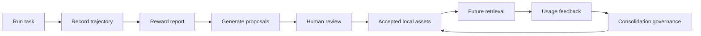

# Praxile

Most coding agents forget what they learned after every run. Praxile gives each repository a governed local experience layer.

Praxile is a local-first, proposal-driven agent harness for code projects. It turns coding-agent runs into auditable project memory, skills, evals, failure patterns, model-routing notes, harness rules, and architecture boundaries, but only after user approval.

It is built around one loop:

```text
User Task -> Environment -> Trajectory -> Reward -> Experience -> Proposal -> Approval -> Better Next Run
```



Praxile does not train or fine-tune models, does not silently rewrite long-term memory, and does not export project facts into global memory. It evolves repository-local experience assets under user governance.

Praxile is not a Hermes or OpenClaw plugin. It owns its own core:

- Model Provider Layer: OpenAI-compatible endpoints, Anthropic, local endpoints, routing policy, routing stats.
- Agent Runtime: task analysis, context retrieval, tool action loop, architecture gate, safety policy.
- Tools: file system, git, shell, test runner, and a registry for agent actions.
- Skills: project-local `.praxile/skills/*/SKILL.md` loading and proposal-driven updates.
- Memory: project/user/decision/failure memory scoped to the current repository.
- Gateway: optional local HTTP gateway for programmatic task submission and review.
- Self-Evolution: trajectory logging, reward reports, experience extraction, proposal approval, rollback.

## Capability Status

| Capability | Current status | Boundary |
|---|---|---|
| Local project state | MVP | `.praxile/` owns project-local memory, skills, rules, trajectories, proposals, and rollback data. |
| Proposal workflow | MVP | Durable evolution updates require user approval and remain auditable. |
| Reward reports | MVP | Hybrid reward combines objective signals, explicit user feedback, and optional LLM judge notes; human review remains required. |
| Semantic judges | Experimental | Optional local cheap-model judges refine feedback, attribution, pattern mining, and counterexamples; they only affect confidence/review guidance, not silent writes. |
| Hybrid retrieval | Experimental | Default `local_hash` is lightweight lexical-vector matching, not strong semantic embedding. |
| Gateway | Experimental | Localhost-first HTTP gateway with token required for non-local binds. |
| Browser adapter | Optional | Playwright evidence capture; UX judgement still needs human acceptance. |
| Channel bindings | Config-only | Telegram/Discord bindings store metadata and token env names; production listeners are not included. |
| External framework interop | Boundary only | Praxile does not auto-load Hermes/OpenClaw memory or skills. |
| Production safety | Not production safe | Alpha software; run in trusted local repositories and review proposals before accepting. |

## Why It Is Different

| Capability | Ordinary coding agent | Praxile |
|---|---|---|
| Task execution | Supported | Supported through guarded environment adapters |
| Project experience | Often forgotten after the run | Proposed as local memory, skill, eval, failure, rule, or boundary assets |
| Failure reuse | Mostly prompt-dependent | Accepted failure patterns become retrievable project experience |
| Architecture boundaries | Usually prompt-only | Architecture Gate and frozen-boundary assets hard-stop risky work |
| Long-term memory safety | Often opaque | Local-first, proposal-only, user-approved |
| Audit and rollback | Varies | Trajectories, reward reports, proposal diffs, and rollback records |

## Install

Prerequisite: Python 3.11 or newer.

For a published release:

```bash
pipx install praxile
# or
uv tool install praxile
```

For local development:

```bash
git clone <praxile-repo-url>
cd praxile
python -m pip install -e .
# optional httpx transport:
python -m pip install -e ".[http]"
# optional semantic/vector retrieval:
python -m pip install -e ".[vector]"
# optional browser screenshots:
python -m pip install -e ".[browser]"
python -m playwright install chromium
```

Want to see the loop without configuring a model first?

```bash
praxile demo --fast --accept-first
```

The demo creates a disposable local Python project, records a failing test, applies a scoped fix, generates reward/proposals, optionally accepts one low-risk memory proposal inside the demo project, and shows retrieval evidence for the next similar task.

Expected shape:

```text
[1/6] Creating fast demo project
[2/6] Recording synthetic failing test
[3/6] Applying scoped fix
[4/6] Recording synthetic verification
[5/6] Generating reward and proposals
[6/6] Showing next-run retrieval evidence
Accepted demo memory proposal: prop_...
Retrieval after accept: 1 memory match(es)
```

Review shape:

```text
Proposal 1/3: prop_... [memory_update] Record project experience: tests/parser/test_fixture_reset.py
This means: Praxile wants to remember a project-local lesson from this run for similar future tasks.
Recommended action: accept
Why: Low-risk project-local proposal with enough confidence and auditable rollback.
Will affect: Future retrieval for tasks matching the recorded files, commands, or failure signature.
Rollback: praxile rollback prop_...
Actions: [a]ccept, [r]eject, [e]dit, [s]kip, [q]uit
```

Explain shape:

```text
Self-Evolution Report
1. Why these experiences were loaded
- .praxile/memory/project.md final_score=1.25 usage=3 positive=2 negative=0
  why: matched task term(s) parser, pytest in title, content
  score impact from usage feedback: 0.22

2. What this run learned
- prop_... [failure_pattern] risk=medium confidence=medium status=pending
  evidence: Action `run_command` failed with AssertionError

3. What will change next time after approval
- .praxile/experience/failures/parser-fixture-reset.md (failure_pattern)
```

Drop `--fast` when you want the demo to run the local unittest subprocess instead of simulated verification evidence.

## Quick Start

Inside any code repository:

```bash
praxile init
praxile setup
praxile doctor --online
praxile run "Fix the failing parser test" --test-command "python -m pytest"
praxile review --interactive
```

After a run, Praxile prints an evolution summary: which accepted project experience was loaded, which proposals were produced, and which command reviews the run-specific proposal inbox. Use `praxile explain latest` to see why memories, skills, rules, or failure patterns were loaded and what this run can teach future tasks.

Praxile writes local state into the target project:

```text
.praxile/
  config.json
  memory/
  skills/
    <skill-name>/
      SKILL.md
      metadata.json
      versions/
  evals/
  rules/
  experience/
  backups/
  db/
  logs/
```

All durable updates are proposals until accepted by the user. `.praxile/config.json` is read as JSONC for hand editing, so comments and trailing commas are accepted even though Praxile writes strict JSON. Fresh installs start with no model provider configured; `praxile setup` walks the user through choosing Ollama, an OpenAI-compatible endpoint, Anthropic, or no model.

`praxile doctor` performs local static checks only, including state layout, configured verification commands, SQLite/FTS index health, and project-map coverage. Use `praxile doctor --online` after editing model settings to run fast endpoint checks for required routes. Model calls default to a 30 second timeout, with `runtime.model_timeout_seconds`, `runtime.online_check_timeout_seconds`, provider-level `timeout_seconds`, and `model.max_retries` available in `.praxile/config.json`.

`praxile init` detects common Python, Node/React, Go, and Rust markers and seeds `runtime.default_test_commands` for new projects. Pass `--test-command` to override detection or `--no-detect` to create only the state layout. Use `praxile init --wizard` to initialize and run setup in one pass.

Model routing is role-based. `praxile setup` writes `model_roles.coding_agent` for stronger coding/tool-action calls, `model_roles.evidence_extraction` and `model_roles.experience_reflection` for cheaper local experience work, `model_roles.reward_judge` for optional quality judging, `model_roles.proposal_composer` for proposal wording, and `model_roles.review_recommendation` for low-cost review classification. Advanced experience-quality roles include `cheap_reasoner`, `feedback_classifier`, `attribution_judge`, `counterexample_checker`, `pattern_mining`, and `project_pattern_composer`; by default these prefer local/Ollama-style routes so review, attribution, mining, and proposal wording do not burn strong coding-model budget. Each role can declare fallback targets. Legacy `routing.*_model` keys are still supported for existing configs and CLI overrides.

For frequent proposal review, use `praxile review --pending` for a queue summary or `praxile review --interactive` to accept, reject, edit in `$EDITOR`, skip, or inspect each proposal in one pass.

Proposal queues are sorted by priority, risk, confidence, type, and evidence. Useful filters:

```bash
praxile review --summary
praxile review --risk high
praxile review --type failure_pattern
praxile review --confidence high
praxile review --source-run <RUN_ID>
praxile review --high-risk
praxile review --recommended accept
praxile review --recommended reject_or_edit
praxile accept --all-low-risk
praxile accept --all-low-risk --yes
praxile accept --all-low-risk --yes --limit 5
praxile reject --low-confidence --reason "too generic"
```

Interactive review shows each proposal in plain language: what accepting it means, the recommended action, why that recommendation was chosen, affected future retrieval/runtime behavior, duplicate warnings, and the exact rollback command. Recommendation labels are:

| Recommendation | Meaning |
| --- | --- |
| `accept` | Low-risk, high-confidence project-local learning with concrete evidence. |
| `inspect` | Architecture, routing, frozen-boundary, harness-rule, or other medium/high-risk proposal. |
| `reject_or_edit` | Useful idea may exist, but the evidence or wording is too weak to accept unchanged. |
| `inspect_duplicate` | A similar active asset already exists and retrieval pollution is possible. |

`praxile accept --all-low-risk` is a dry run by default. Add `--yes` to apply. High-risk proposal types such as architecture gates, frozen boundaries, harness rules, and routing policy are never batch-accepted by `--all-low-risk`.

For safe exploration, `praxile run "task" --dry-run` allows analysis, retrieval, planning, and proposal generation while blocking file edits and shell commands. `praxile run` also supports temporary routing overrides such as `--model-coding gpt-4o --max-steps 15`, without rewriting config. Interrupted runs write checkpoints under `.praxile/checkpoints/` and can continue with `praxile run --resume <TASK_ID>`. If the experience index ever looks stale, run `praxile index status --scan`, queue changed assets with `praxile index watch --once`, or process explicit paths with `praxile index update --path .praxile/memory/project.md`. `praxile index rebuild` remains an explicit deep repair path.

Reward scoring is configurable under `.praxile/config.json`. Project teams can tune score weights, cost thresholds, and the treatment of projects with no detected tests versus detected tests that were not run.

Reward reports distinguish execution success from experience value. They include objective reward, user feedback reward, optional LLM judge reward, final reward, execution, safety, regression, scope control, cost, experience value, proposal quality, and `should_generate_experience` so low-evidence runs do not have to create durable learning proposals.

Explicit feedback becomes part of the governed loop:

```bash
praxile feedback latest --positive "干得好，这次修得很准确"
praxile feedback latest --negative "这次方向错了"
praxile feedback prop_123 --negative "这个 proposal 太泛了"
praxile feedback asset .praxile/skills/test-repair/SKILL.md --helpful
praxile feedback asset .praxile/rules/harness-rules/ui.md --harmful "这条规则误导了你"
praxile feedback auto "这次修得很好，但第二条 proposal 太泛，那个 parser skill 先别再用了"
```

Run feedback updates the run's `user_feedback_reward` and `final_reward`. Proposal feedback can lower confidence and shift review guidance toward `reject_or_edit`. Negative asset feedback records a harmful outcome and generates a proposal-only lifecycle review instead of silently rewriting durable memory, skills, or rules. `feedback auto` is rule-first and conservative: it can split one natural-language note into run, proposal, asset, or pattern feedback, and durable negative asset feedback still requires governed proposal review.

## Engineering Notes

Praxile uses a short-lived cached project map instead of dumping a fixed flat file list into the model. The runtime can expand context with `project_map`, `list_dir`, `find_files`, range-aware `read_file`, and ripgrep-backed `search`; sensitive paths are still filtered a second time by the safety layer. Use `{"type":"project_map","refresh":true}` when a fresh scan matters.

During long tasks, Praxile refreshes the project snapshot after mutating actions, compresses old observations before the prompt grows too large, and writes structured trace events to daily `.praxile/logs/trace_YYYYMMDD.jsonl` files with retention cleanup. Model routing can fall back through configured backup routes when the primary provider is unavailable.

Experience retrieval is indexed in SQLite with FTS5 when available. Proposal accept/rollback and trajectory recording update only the affected index rows. The asset table records `mtime_ns`, `size`, and `content_hash`; routine indexing compares mtime/size before reading files for hashes. `praxile index watch --once` performs an explicit scan/queue/update pass, and `praxile index rebuild` remains an intentional deep repair path.

Hybrid retrieval is available behind config flags. Praxile stores local vector rows in SQLite and can combine FTS plus vector scores when `retrieval.vector_enabled=true` and `retrieval.hybrid_enabled=true`. The default `retrieval.vector_provider="local_hash"` is a zero-dependency lexical-vector fallback; installing `praxile[vector]` allows `retrieval.vector_provider="sentence_transformers"` for semantic embeddings.

Retrieval results include explainable fields such as `matched_terms`, `matched_fields`, `fts_rank`, `vector_score`, `priority_boost`, `usage_count`, positive/negative outcome counts, `score_impact`, `final_score`, and `why_loaded`. `praxile explain latest` also distinguishes loaded-only context from assets referenced in observations or explicitly used by the run, so a passing task does not automatically credit every retrieved memory or skill.

Praxile refuses normal project writes when configured external-agent lock signals are present, such as `.hermes/agent.lock` or `.openclaw/agent.lock`. This keeps optional interop from becoming unsafe concurrent editing.

Task analysis is deterministic by default. Set `task_analysis.llm_assisted=true` to let the configured `llm_model_role` route, such as `cheap_model`, `review_recommendation`, or `planning_model`, add lightweight intent/risk signals. LLM analysis can raise risk but cannot bypass accepted frozen boundaries.

Semantic judges are also off by default. Set `semantic_judges.enabled=true` to let local cheap-model roles refine four judgement points after heuristic candidate recall: `feedback_classifier`, `attribution_judge`, `pattern_mining`, and `counterexample_checker`. Their outputs are structured JSON and can adjust attribution level, pattern score, counterexamples, confidence, and recommended review action. They cannot silently write memory, skills, rules, or lifecycle changes; durable changes still require proposals.

Experience extraction is also deterministic by default. Set `evolution.llm_assisted_proposals=true` to let `model_roles.proposal_composer` or the legacy `evolution_model` route propose extra experience assets. LLM-assisted proposals must include evidence, confidence, applicability scope, anti-scope, and safe `.praxile/` target paths; they remain pending diffs until explicitly accepted and cannot create architecture gates, frozen boundaries, config mutations, or safety bypasses.

Optional LLM reward judging is disabled by default. Set `reward.llm_judge.enabled=true` to call `model_roles.reward_judge`; judge output is recorded as `llm_judge_reward` and mixed into `final_reward` only as an active component. Judge output includes specificity, scope fit, evidence fit, intent alignment, overgeneralization risk, and a recommended action. High overgeneralization risk cannot auto-approve a proposal; it is demoted into inspect or reject/edit guidance. Objective test/safety signals are never replaced by judge notes.

Accepted experience assets use a lifecycle shape. `active` assets participate in retrieval by default; `deprecated`, `superseded`, and `archived` assets remain auditable on disk and in the SQLite index but are excluded from normal runtime loading. Skills additionally keep `SKILL.md` as the active runtime view, `metadata.json` for status/version, and `versions/<version>.md` for accepted snapshots. Useful lifecycle commands:

```bash
praxile memory list
praxile memory list --include-inactive
praxile asset status .praxile/memory/project.md
praxile asset deprecate .praxile/memory/old-note.md --reason "replaced by parser skill"
praxile asset supersede .praxile/memory/old-note.md --replaced-by .praxile/skills/parser-repair/SKILL.md
praxile asset archive .praxile/experience/failures/old-failure.md --reason "obsolete"
praxile asset reactivate .praxile/memory/old-note.md --reason "useful again"
praxile asset diff .praxile/memory/old-note.md --with .praxile/skills/parser-repair/SKILL.md
praxile skill history <SKILL_NAME>
```

Lifecycle changes can also arrive as governance proposals. `asset_deprecate` writes sidecar lifecycle metadata so the original asset remains intact, while `asset_merge` marks duplicate assets as `superseded` and points them at a canonical replacement. `asset_rewrite`, `asset_archive`, and `asset_reactivate` keep the same proposal-and-rollback model for content cleanup and lifecycle restoration. Proposal accept and rollback both reindex only the affected assets.

`praxile consolidate` scans indexed experience assets for duplicate, stale, conflicting, or low-value local experience and creates proposal-only governance outputs such as `asset_merge`, `asset_deprecate`, and cleanup review notes. It does not delete or rewrite memory, skills, evals, or failure patterns automatically. See the [experience governance guide](docs/experience-governance.md) for the full consolidate -> review -> merge/archive loop.

Consolidation output shape:

```text
Created 2 consolidation proposal(s):
- prop_... [asset_merge] Supersede duplicate experience assets for `parser-fixture-reset`
- prop_... [asset_rewrite] Rewrite weak experience asset `memory/weak-but-useful.md`

Review next:
praxile review --type asset_merge
praxile review --type asset_rewrite
```

For larger repositories, consolidation can focus on specific governance issues:

```bash
praxile consolidate --summary --all
praxile consolidate --duplicates
praxile consolidate --stale --stale-days 90
praxile consolidate --conflicts
praxile consolidate --low-value
```

All consolidation outputs remain pending proposals.

Project memory uses a soft-limit sharding guard. Routine memory updates go to `memory/project.md` until it grows too large; after that, proposals target `memory/shards/YYYY-MM.md` so hot memory stays searchable and future consolidation can merge similar notes.

Model calls go through an HTTP transport abstraction. The default path remains dependency-free `urllib`; installing `praxile[http]` enables optional `httpx` transport when `model.transport` is `auto` or `httpx`. The httpx transport keeps a reusable client for connection pooling and exposes `close()` for explicit cleanup. Both transports include an SSE `stream_json` path for future streaming CLI output.

The action protocol supports read-only concurrency through `batch`, which can run up to 8 safe read-only actions such as `read_file`, `read_files`, `search`, `list_dir`, and `find_files` with `asyncio`. Write actions and shell commands are rejected inside batch.

The optional browser environment uses Playwright when `browser.enabled=true`. It supports `browser_open` and `browser_screenshot`, stores screenshot artifacts under `.praxile/experience/artifacts/browser/`, and records artifact paths in trajectories. It is still paired with human UX acceptance; screenshots are evidence, not an automatic judgement of visual quality.

Shell features such as pipes, redirects, variable expansion, and command chaining stay disabled by default. Set `shell.allow_shell_features=true` only together with reviewed `safety.allowed_command_prefixes`; each executable segment is checked, redirection targets must stay inside the project, and dangerous patterns are still blocked before execution. Edit backups are capped by `safety.backup_max_files` and `safety.backup_max_bytes` so long-running projects do not grow `.praxile/backups/` without bound.

State writes use cross-platform file locks where the operating system supports them, and proposal application keeps a recovery journal for multi-file updates so an interrupted accept can be restored on the next store initialization.

## Terminal

Start Praxile's interactive terminal:

```bash
praxile terminal
```

Useful commands inside the terminal:

```text
status
run Fix the failing parser test --test-command "python -m pytest"
review
proposals
accept <PROPOSAL_ID>
reject <PROPOSAL_ID>
history
memory parser
channels
exit
```

This is not a raw unrestricted shell. It is an agent terminal that sends work through Praxile's safety, trajectory, reward, proposal, and rollback layers.

See `examples/react`, `examples/go`, and `examples/rust` for minimal cross-stack repositories that demonstrate project detection and the same self-evolution loop.

## Contributing

Before opening a PR, run:

```bash
python -m compileall praxile tests scripts
make test-fast
make test-fast-repeat
make test-resource
make test-integration
```

The default contributor loop excludes slow, integration, and resource-sensitive tests so routine runs stay short. Shell, gateway, browser, terminal, runtime, HTTP transport, and SQLite-heavy checks live under `tests/resource/` with explicit markers, so leaks can be isolated instead of hiding inside one monolithic suite. Release checks run the full suite in isolated subprocesses.

See `CONTRIBUTING.md`, `docs/contributing-testing.md`, and `SECURITY.md` for project-local evolution rules, testing boundaries, safety boundaries, and disclosure guidance.

## Gateway

Run the optional local gateway:

```bash
praxile gateway serve --host 127.0.0.1 --port 8765
```

Open the local console:

```text
http://127.0.0.1:8765/
```

The browser console is intended for trusted localhost use. Praxile refuses non-localhost gateway binds such as `0.0.0.0` unless `--token` is provided. `--token` is best for API clients that can send `Authorization` or `X-Praxile-Token` headers. The built-in gateway uses a bounded worker pool; tune `gateway.max_threads` in config for local capacity.

Then submit a task:

```bash
curl -X POST http://127.0.0.1:8765/run \
  -H 'Content-Type: application/json' \
  -d '{"task":"Record project context","max_steps":1}'
```

For token protection:

```bash
praxile gateway serve --token "$PRAXILE_GATEWAY_TOKEN"
praxile gateway serve --host 0.0.0.0 --token "$PRAXILE_GATEWAY_TOKEN"
```

## Config And Channels

Praxile config is JSON:

```text
.praxile/config.json
```

The repository includes [praxile.config.example.json](praxile.config.example.json) with clean defaults, safety policy, gateway settings, model-role shape, and channel-binding structure. Telegram and Discord bindings store channel IDs and token environment variable names, not raw bot tokens.

Useful commands:

```bash
praxile channel list
praxile channel show <BINDING_ID>
praxile channel env
praxile channel unbind <BINDING_ID>
```

First release boundary: Praxile manages auditable local channel configuration and gateway route metadata. Production Telegram/Discord bot listeners are the next layer on top of this config.

## Optional Adapters

Hermes/OpenClaw are optional adapter targets or endpoint sources. Praxile can detect compatible framework modules with:

```bash
praxile interop
```

Adapters do not own `.praxile/` state. Project memory and skills are not automatically exported into external frameworks.

## Docs

- [Architecture](docs/ARCHITECTURE.md)
- [Configuration](docs/CONFIGURATION.md)
- [Experience Governance](docs/experience-governance.md)
- [Getting Started](docs/GETTING_STARTED.md)
- [Install and Interop](docs/INSTALL_AND_INTEROP.md)
- [Product Vision](docs/PRODUCT_VISION.md)
- [Proposal Decision Guide](docs/proposal-decision-guide.md)
- [State Layout](docs/STATE_LAYOUT.md)
- [Core Layers](docs/CORE_LAYERS.md)
