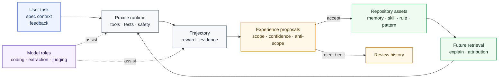
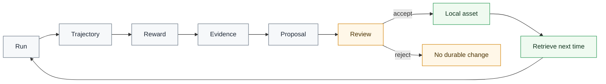

# Praxile

<div align="center">

<!-- Optional: replace this with your project logo. -->

<!--  -->

<h3>Governed experience harness for AI coding</h3>

<p>
  <b>Specs govern intent. Praxile governs experience.</b>
</p>

<p>
  Turn AI coding-agent runs into <b>evidence-backed</b>, <b>reviewable</b>, repository-local knowledge.
</p>

<p>
  <a href="./README.zh-CN.md"><b>简体中文</b></a>
  ·
  <b>English</b>
</p>

<p>
  
  
  
  
</p>

</div>

***


## What is Praxile?

**Praxile** is a governed experience harness for AI coding.

It captures what an AI coding agent actually did, turns the run into evidence-backed proposals, and stores only approved repository-local experience under `.praxile/`.

Praxile is **not** a general-purpose coding agent, **not** a hidden global memory, and **not** a Spec Kit replacement.

It is the governance layer around AI coding work:

- environment interaction;
- trajectory logging;
- reward and feedback;
- evidence extraction;
- proposal review;
- audit and rollback;
- future retrieval.

The goal is simple:

> Coding agents should not have to relearn the same repository over and over again — but they should not remember unchecked experience either.

***

## Why Praxile?

Most coding agents can edit files, call tools, and run tests.

The harder problem is deciding **what the project should remember after the run**.

Without a governed experience layer, coding-agent workflows often become:

| Problem            | Typical agent workflow | With Praxile                                           |
| ------------------ | ---------------------- | ------------------------------------------------------ |
| Project experience | Lost after each run    | Captured as evidence-backed local experience           |
| Long-term memory   | Hidden or automatic    | Proposal-governed and human-approved                   |
| Repeated failures  | Rediscovered manually  | Converted into reusable failure patterns               |
| Project rules      | Buried in prompts      | Stored as scoped repository-local assets               |
| Feedback           | Informal and discarded | Recorded as reward and governance signal               |
| Explainability     | Hard to inspect        | `praxile explain latest` shows why experience was used |
| Safety             | Depends on the agent   | Enforced by rules, review gates, rollback, and audit   |

Praxile makes the memory loop explicit:

```text
User Task
  -> Environment Interaction
  -> Trajectory
  -> Reward Report
  -> Evidence / Episodes
  -> Experience Proposals
  -> Human Review
  -> Approved Repository Asset
  -> Future Retrieval
```

***

## Core ideas

### 1. Spec before coding, experience after coding

Spec-driven development helps define what an agent should build before execution.

Praxile focuses on what happens after execution:

```text
What did the agent try?
What evidence was produced?
What failed?
What passed?
What should be reused?
What must be reviewed before becoming durable knowledge?
```

In short:

> Specs govern intent. Praxile governs experience.

### 2. No durable memory without review

Praxile does not silently rewrite long-term memory.

A run can produce evidence. Evidence can become an episode. Episodes can reveal patterns. Patterns can produce proposals.

But durable repository knowledge is written only after review.

### 3. Markdown-first, indexed for retrieval

Praxile keeps durable assets readable and reviewable.

- Markdown / JSON under `.praxile/` keeps experience inspectable.
- SQLite / FTS / optional vector indexes support search and retrieval.
- Usage and feedback metadata support attribution and lifecycle governance.

***

## Feature highlights

- **Repository-local experience**\
  Memories, skills, rules, evals, failure patterns, project patterns, frozen boundaries, and architecture gates live under `.praxile/`.
- **Proposal-governed evolution**\
  Durable changes start as evidence-backed proposals and require explicit review.
- **Trajectory and reward reports**\
  Praxile separates task success, regression safety, process safety, cost, experience value, and user feedback.
- **Evidence-driven learning**\
  Runs are converted into evidence, episodes, patterns, and scoped proposals.
- **Spec-aware workflow**\
  Optional `spec.md`, `plan.md`, `tasks.md`, and `constitution.md` context can shape reward and proposal gating.
- **Explainable retrieval**\
  Praxile can explain which assets were loaded, why they matched, and how they influenced future runs.
- **Safety and rollback**\
  Sensitive path protection, dangerous command blocking, backups, architecture gates, and proposal rollback are built into the loop.

***

## Architecture at a glance



***

## Core loop



***

## Installation

Praxile requires **Python 3.11+**.

### Install from GitHub

```bash
pipx install "git+https://github.com/Praxile-Alpha/Praxile.git"
```

Or with `uv`:

```bash
uv tool install "git+https://github.com/Praxile-Alpha/Praxile.git"
```

### Development install

```bash
git clone https://github.com/Praxile-Alpha/Praxile.git
cd Praxile
python -m pip install -e ".[http]"
```

Optional extras:

```bash
python -m pip install -e ".[vector]"   # semantic retrieval
python -m pip install -e ".[browser]"  # browser evidence capture
python -m playwright install chromium
```

***

## Try it without a model

Run the local demo:

```bash
praxile demo --fast --accept-first --show-files
```

The demo runs locally and does not require a model endpoint. It creates a tiny project, records a trajectory, builds a reward report, generates proposals, accepts one low-risk memory inside the demo project, and shows how the next run would retrieve it.

***

## Quick start

### 1. Initialize a repository

```bash
cd /path/to/your/code-project
praxile init
praxile setup
praxile doctor
praxile doctor --online
```

`praxile setup` configures providers and model roles. Praxile stores environment variable names such as `OPENAI_API_KEY` or `OLLAMA_API_KEY`; it does not store raw API keys.

### 2. Run a task

```bash
praxile run "Fix the failing parser test" --test-command "python -m pytest"
```

### 3. Review what Praxile learned

```bash
praxile review --interactive
praxile explain latest
```

### 4. Accept or reject proposals

```bash
praxile accept <PROPOSAL_ID>
praxile reject <PROPOSAL_ID> --reason "too broad"
```

***

## Spec-aware workflow

Attach spec context when a task has explicit intent, non-goals, acceptance criteria, or success metrics:

```bash
praxile run "Implement search API"   --spec docs/specs/search.md   --test-command "python -m pytest"
```

Then verify the result against the attached spec:

```bash
praxile spec verify latest
```

A task can pass tests but still produce weak or blocked experience proposals if it violates scope, skips acceptance criteria, or changes architecture without a gate.

***

## Experience model

Praxile experience is not only Markdown and not only a graph.

| Layer            | Purpose                                                  |
| ---------------- | -------------------------------------------------------- |
| Markdown / JSON  | Human-readable durable assets and structured run records |
| SQLite           | Asset metadata, lifecycle status, usage, and provenance  |
| FTS              | Keyword retrieval                                        |
| Vector index     | Optional semantic retrieval                              |
| Proposal history | Review, acceptance, rejection, rollback                  |
| Audit chain      | Explain where an asset came from and how it was used     |

Approved assets are active by default. Deprecated, superseded, and archived assets stay auditable but are excluded from normal retrieval.

***

## Common commands

```text
praxile init                    Initialize .praxile in the current repository
praxile setup                   Configure providers and model roles
praxile demo --fast             Run a local governed-experience demo
praxile run "..."               Execute an agent task
praxile run "..." --dry-run     Analyze and record without editing files
praxile review --interactive    Review pending proposals
praxile explain latest          Explain retrieval, reward, and proposals
praxile feedback latest ...     Add explicit feedback
praxile spec check              Check optional spec quality signals
praxile spec verify latest      Verify a run against spec context
praxile consolidate --all       Propose cleanup for stale or overlapping assets
praxile audit check             Run a governance gate
praxile rollback <ID>           Roll back task edits or accepted proposals
praxile doctor --online         Validate config, routes, and local state
```

For the full CLI reference, see [Getting Started](docs/GETTING_STARTED.md).

***

## Local state

Praxile writes repository-local state under `.praxile/`:

```text
.praxile/
  config.json
  constitution.md
  memory/
  skills/
  evals/
  rules/
  experience/
    trajectories/
    evidence/
    episodes/
    patterns/
    proposals/
    feedback/
  backups/
  db/
  logs/
```

Do not put raw secrets in `.praxile/config.json`. Use environment variables through `api_key_env` and channel `token_env` settings.

***

## Interop boundary

Praxile can detect optional external-agent capabilities and can use OpenAI-compatible endpoints, but it is not a Hermes or OpenClaw plugin.

- `.praxile/memory` is not written into external global memory.
- `.praxile/skills` are not installed into external skill stores.
- Praxile trajectories are the source of truth.
- External-compatible sidecars are exports.
- Future external sync should go through explicit adapter commands and auditable proposals.

***

## Current status

Praxile is **Alpha** software.

Implemented core loop:

- init / setup / doctor;
- local demo;
- run / trajectory logging;
- reward report;
- evidence and proposal generation;
- review / accept / reject;
- repository-local assets;
- retrieval and explain;
- rollback.

Experimental or evolving:

- spec-aware workflow;
- experience indexing and provenance graph;
- audit exports;
- isolated workspaces;
- terminal and local gateway;
- channel configuration;
- semantic judges.

Not included in the first release:

- automatic model weight training;
- marketplace distribution;
- silent global memory sync;
- automatic production Telegram / Discord listeners;
- unrestricted shell execution;
- autonomous acceptance of durable experience.

***

## Documentation

- [Getting Started](docs/GETTING_STARTED.md)
- [Configuration](docs/CONFIGURATION.md)
- [Architecture](docs/ARCHITECTURE.md)
- [Experience Model](docs/EXPERIENCE_MODEL.md)
- [Why Praxile](docs/WHY_PRAXILE.md)
- [Audit Governance](docs/audit-governance.md)
- [Install And Interop](docs/INSTALL_AND_INTEROP.md)
- [Testing Guide](docs/contributing-testing.md)
- [Security Policy](SECURITY.md)

***

## Contributing

Contributions are welcome.

Good first areas:

- proposal quality and deduplication;
- spec-aware experience;
- retrieval quality;
- semantic judge evaluation;
- explainability;
- audit and governance UX.

Please read `CONTRIBUTING.md` and `SECURITY.md` before submitting changes.

***

## License

MIT License. See [LICENSE](LICENSE).
