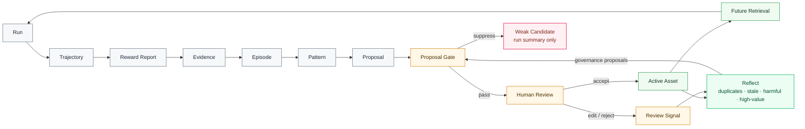
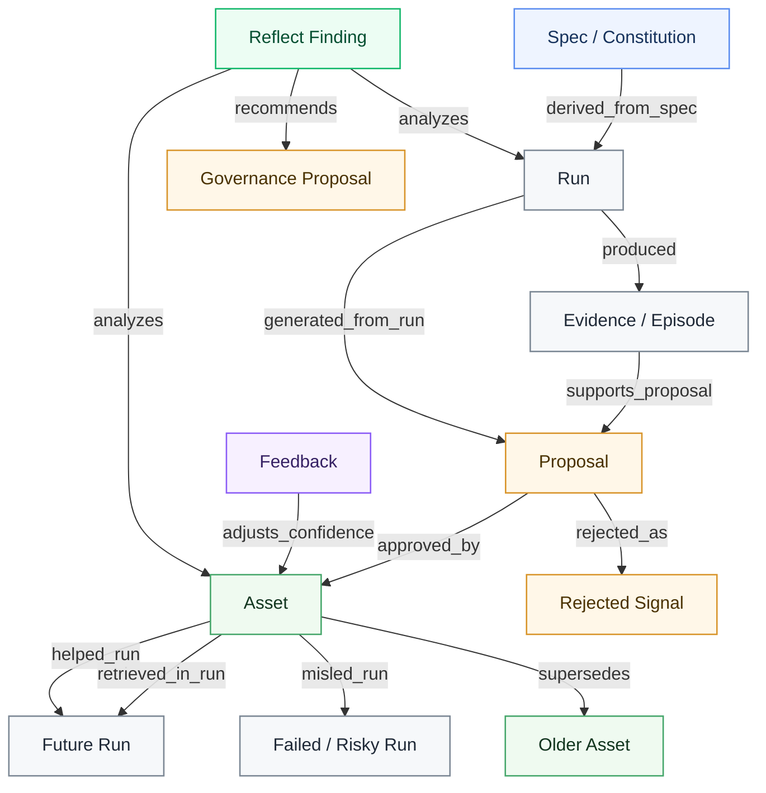

# Praxile

<div align="center">

<!-- Optional: replace this with your project logo. -->
<!--  -->

<h3>Eval and Evolution Control Plane for Agent Harnesses</h3>

<p>
  <b>Specs govern intent. Praxile governs experience.</b>
</p>

<p>
  Observe what base agents actually did, evaluate what worked, and turn runs into governed candidates.<br />
  Only approved repository-local knowledge becomes active under <code>.praxile/</code>.
</p>

<p>
  <a href="./README.zh-CN.md"><b>简体中文</b></a>
  ·
  <b>English</b>
</p>

<p>
  
  
  
  
</p>

</div>

---

## What is Praxile?

**Praxile** is an evaluation and evolution control plane for Agent Harnesses.

> **V2 boundary:** External Base Agents own planning, tools, and execution. Praxile owns normalized trace, evaluation, diagnosis, governed assets, policy candidates, promotion, and rollback. The P0 reference path is runnable and publicly documented; it is an engineering acceptance result, not a broad benchmark claim. See the [V2 P0 public result](docs/V2_P0_PUBLIC_RESULT.md) and [frozen boundary](docs/V2_P0_FROZEN_BOUNDARY.md).

The measured V2 reference system is **mini-SWE-agent as the Base Agent + Praxile as the Control Plane + SWE-bench as the evaluator**. Results belong to that complete system. Praxile does not relabel the Base Agent's model calls, tool use, or coding behavior as Praxile execution capability.

It sits around coding-agent work: it records environment interaction, builds a trajectory, computes reward and risk signals, extracts evidence, generates reviewable proposals, and writes durable repository knowledge only after human approval.

Praxile includes a **Chat-first Web Console** that provides a familiar AI agent workspace seamlessly integrated with deep governance, spec-aware execution, and reflective auditing.

Praxile is **not** another general-purpose coding agent, **not** a hidden global memory, and **not** a Spec Kit replacement.

It is designed for developers and teams who want AI coding workflows to become more reusable over time without losing control over what the project remembers.

> Spec-driven development governs what the agent should build before execution. Praxile governs what the project should learn after execution.

The wider agent ecosystem is converging on durable execution, human approval, skills, memory, and interoperable tools. Praxile focuses on the unresolved step after those capabilities: **proving which execution experience deserves to change the future harness**. Its governed proposal flow is the foundation; the next stage separates proposal generation from evidence-based credit, measures whether accepted experience was actually activated, and keeps an immutable governance boundary around self-modification.

See [Agent Harness Landscape 2026](docs/AGENT_HARNESS_LANDSCAPE_2026.md) for the industry and research context, and [Trusted Harness Evolution Roadmap](docs/TRUSTED_HARNESS_EVOLUTION_ROADMAP.md) for the implementation plan. Research-inspired items in the roadmap are explicitly marked as planned; they are not presented as current capabilities.

---

## Why Praxile?

Most coding agents can edit files, call tools, and run tests.

But the harder problem is deciding **what should become long-term project knowledge after the run**.

| Problem | Typical coding-agent workflow | With Praxile |
|---|---|---|
| Project experience | Lost after each run | Captured as evidence-backed repository experience |
| Long-term memory | Hidden or automatic | Proposal-governed and human-approved |
| Repeated failures | Rediscovered manually | Converted into scoped failure patterns |
| Project rules | Buried in prompts | Stored as repository-local governed assets |
| Spec alignment | Checked informally | Spec context can influence reward and proposal quality |
| Silent failures | Hard to detect | Risk signals flag runs that look successful but are weakly verified |
| Experience decay | Rarely maintained | Reflect finds duplicates, stale assets, harmful assets, and recurring risks |
| Explainability | Difficult to inspect | `praxile explain latest` shows retrieval, reward, and proposals |
| Governance | Manual and scattered | Audit, rollback, lifecycle status, and provenance graph |

---

## Architecture at a glance


```mermaid
flowchart LR
    classDef input fill:#EEF4FF,stroke:#5B8DEF,color:#16325C,stroke-width:1.5px;
    classDef interface fill:#F6F8FA,stroke:#7B8794,color:#1F2937,stroke-width:1.5px;
    classDef runtime fill:#F3F7FF,stroke:#4F7FD9,color:#102A56,stroke-width:1.5px;
    classDef engine fill:#F7F0FF,stroke:#8B5CF6,color:#352063,stroke-width:1.5px;
    classDef gov fill:#FFF7E8,stroke:#D8942A,color:#4A3200,stroke-width:1.5px;
    classDef asset fill:#EFFAF0,stroke:#45A66A,color:#12351F,stroke-width:1.5px;
    classDef audit fill:#F2F4F7,stroke:#667085,color:#182230,stroke-width:1.5px;
    classDef reflect fill:#ECFDF3,stroke:#12B76A,color:#054F31,stroke-width:1.5px;

    U["User Task<br/>feedback"]:::input
    S["Spec Context<br/>spec.md · plan.md · tasks.md · constitution.md"]:::input

    U --> I["Interfaces<br/>CLI · Terminal · Gateway"]:::interface
    S --> I

    I --> R["Runtime Harness<br/>task analyzer · model router · tools · tests · safety · workspace"]:::runtime
    R --> T["Trajectory Ledger<br/>actions · observations · diffs · commands · artifacts"]:::runtime
    T --> E["Experience Engine<br/>reward · evidence · episodes · patterns"]:::engine
    E --> G["Governance Layer<br/>silent-failure signals · proposal gate · human review"]:::gov
    G --> A["Repository Assets<br/>memory · skill · rule · eval · pattern · boundary"]:::asset
    A --> Q["Future Retrieval<br/>explain · attribution · consolidation"]:::asset
    Q --> R

    A --> F["Praxile Reflect<br/>offline refinement · cleanup · promotion"]:::reflect
    T --> F
    G --> F
    F -->|reviewable proposals| G

    T --> O["Audit & Provenance<br/>graph · redaction · CI gates · rollback"]:::audit
    G --> O
    A --> O
    F --> O
```

Praxile is intentionally layered:

1. **Spec and task input** describe intent, constraints, and acceptance criteria.
2. **Runtime harness** executes through controlled tools, tests, safety rules, and optional workspace isolation.
3. **Trajectory ledger** records what actually happened.
4. **Experience engine** turns the run into reward, evidence, episodes, and patterns.
5. **Governance layer** filters weak or risky learning through silent-failure detection, proposal gates, and human review.
6. **Repository assets** become durable only after approval.
7. **Praxile Reflect** periodically analyzes accumulated experience and generates reviewable cleanup/refinement proposals.
8. **Audit and provenance** make the experience chain explainable, exportable, and reversible.

---

## Core governed experience loop


```mermaid
flowchart LR
    classDef step fill:#F6F8FA,stroke:#7B8794,color:#1F2937,stroke-width:1.3px;
    classDef gate fill:#FFF7E8,stroke:#D8942A,color:#4A3200,stroke-width:1.3px;
    classDef asset fill:#EFFAF0,stroke:#45A66A,color:#12351F,stroke-width:1.3px;
    classDef weak fill:#FFF1F3,stroke:#E31B54,color:#7A271A,stroke-width:1.3px;
    classDef reflect fill:#ECFDF3,stroke:#12B76A,color:#054F31,stroke-width:1.3px;

    A["Run"]:::step --> B["Trajectory"]:::step --> C["Reward Report"]:::step --> D["Evidence"]:::step --> E["Episode"]:::step --> F["Pattern"]:::step --> G["Proposal"]:::step
    G --> H["Proposal Gate"]:::gate
    H -->|pass| I["Human Review"]:::gate
    H -->|suppress| W["Weak Candidate<br/>run summary only"]:::weak
    I -->|accept| J["Active Asset"]:::asset
    I -->|edit / reject| K["Review Signal"]:::gate
    J --> L["Future Retrieval"]:::asset
    L --> A

    J --> R["Reflect<br/>duplicates · stale · harmful · high-value"]:::reflect
    K --> R
    R -->|governance proposals| H
```

The core rule is simple:

> A run may produce learning signals, but only approved proposals become durable repository knowledge.

### Context representation and judge calibration

Praxile now governs both **how experience enters a run** and **how a run's quality claims are verified**.

```text
Retrieved assets
  -> deterministic semantic activation gate
  -> representation policy
  -> none | raw_episode | summary_memory | skill | failure_pattern
  -> bounded prompt injection

LLM self-judgment ---------------------> calibration
Objective environment verification ---> calibration
Later task outcome --------------------> observational transfer effect
```

The P2-B representation router runs in normal `praxile run` execution as well as controlled A/B experiments. Retrieval alone does not count as use: an asset is credited only when semantic activation passes, the router selects a bounded representation, and that representation is injected. Selection decisions and token-budget estimates are written to the trajectory.

P2-C stores `self_judgment`, `verifier_outcome`, `next_task_delta`, `judgment_calibration`, and `transfer_effect` separately. It reports judge precision, calibration error, and false-promotion rate. An LLM judge may prioritize a proposal for review, but **self-judgment alone cannot make that proposal eligible for promotion**. Objective verifier evidence and explicit human approval remain mandatory; controlled A/B evaluation is still required for causal claims.

P2-D makes Harness Candidates executable under immutable manifests. It repeats isolated development and held-out experiments, reports E/T/C/S/L/V runtime coverage and dead mechanisms, calculates confidence intervals, and scopes promotion by component, executor profile, and task family.

```bash
praxile judge metrics
praxile judge metrics --json --include-observations
praxile judge calibrate path/to/suite.json --write-proposal
```

See [P2-B Experience Representation](docs/P2_B_EXPERIENCE_REPRESENTATION.md) and [P2-C Judge Calibration](docs/P2_C_JUDGE_CALIBRATION.md).

---

## Feature highlights

- **Chat-First Web Console**  
  A zero-dependency local workspace (`praxile gateway serve`) offering Chat Execution, Run Details, Governance Context, and Repository Context health.
- **Repository Context Sync**  
  `praxile sync` captures a local, auditable repository context snapshot with Context Health, file-category signals, git dirtiness, recent commits/diffs, docs/spec indexes, optional local CI/GitHub context, experience counts, and ContextJuice estimates. It writes `.praxile/context/repo_snapshot.json`, `.praxile/context/commits/`, `.praxile/context/diffs/`, plus historical snapshots.
- **ContextJuice and Repository Memory Tree**  
  `praxile context compress` produces role-specific compressed context with preserved evidence metadata; `praxile context tree` builds a human-readable memory tree under `.praxile/context/tree/`.
- **Semantic activation and experience representation**
  Retrieved experience passes a deterministic activation gate and is then represented as `none`, bounded raw episode, summary memory, skill, or failure pattern. Retrieved and injected assets are audited separately.
- **Calibrated semantic judges**
  LLM self-judgment is stored separately from objective verifier outcomes and later transfer observations. Precision, calibration error, and false-promotion rate expose when a judge is overconfident.
- **Policy Layers and governance loop**  
  `praxile policy list/check/explain` inspects project-local governance layers, and `praxile watch` runs safe governance passes that can sync, compress, audit, rebuild graph, and reflect without editing code or auto-accepting proposals.
- **Workflow Templates**  
  `praxile workflow list/show/seed` exposes editable task workflows such as test-failure repair, spec-driven feature work, architecture changes, security fixes, and migrations.
- **Repository-local experience**  
  Memories, skills, rules, evals, failure patterns, project patterns, frozen boundaries, and architecture gates live under `.praxile/`.
- **Spec-aware execution**  
  Optional spec, plan, task, and constitution context can shape reward, silent-failure signals, and proposal gating.
- **Evidence-backed proposals**  
  Durable changes start as proposals with source runs, evidence summaries, confidence, applicability scope, anti-scope, and rollback paths.
- **Proposal gate and human review**  
  Weak, under-scoped, low-evidence, or risky learning candidates can be suppressed before they become review burden.
- **Silent-failure detection**  
  Praxile flags runs that look successful but may be weakly verified, over-broad, under-specified, or poorly attributed.
- **Praxile Reflect**  
  Offline, proposal-governed experience refinement: detect duplicates, stale assets, harmful assets, repeated silent failures, rejected-proposal themes, and high-value patterns.
- **Reward and attribution**  
  Task success, regression safety, process safety, cost, experience value, user feedback, and asset attribution are tracked separately.
- **Experience graph and audit chain**  
  Praxile builds a rebuildable local provenance graph from specs, runs, proposals, assets, feedback, reflect reports, and future retrieval.
- **Safety and rollback**  
  Sensitive path protection, dangerous command blocking, project-local `.praxile/rules/safety-policy.json`, backups, architecture gates, workspace isolation, and proposal rollback are part of the loop.

---

## Praxile Reflect

Praxile Reflect is the offline governance pass over accumulated repository experience.

It is inspired by the idea of periodically reviewing long-running agent memory, but it deliberately avoids automatic memory rewrites.

```text
Past Runs + Assets + Feedback + Silent-Failure Signals + Provenance Graph
  -> Reflect
  -> Findings
  -> Reviewable Governance Proposals
  -> Human Review
  -> Asset Merge / Deprecate / Rewrite / Promote
```

Reflect can find:

- duplicate or overlapping assets;
- stale or unused memories, skills, rules, and patterns;
- assets with negative outcomes or harmful feedback;
- repeated silent-failure signals;
- repeated rejected-proposal themes;
- high-value patterns worth promoting into skills, rules, or checklists.

Common commands:

```bash
praxile reflect --summary
praxile reflect --since 7d
praxile reflect --duplicates --stale --silent-failures
praxile reflect --harmful --rejected-proposals --high-value-patterns
praxile reflect --asset .praxile/memory/project.md
praxile reflect --report markdown --output reflect.md
praxile reflect --write-proposals
praxile reflect --ci
```

Boundary:

> Reflect does not rewrite memory directly. It proposes governed experience updates.

---

## Experience graph

Praxile is not just a collection of Markdown files. It builds a local provenance graph that explains where experience came from and how it was used.


```mermaid
flowchart TB
    classDef spec fill:#EEF4FF,stroke:#5B8DEF,color:#16325C,stroke-width:1.3px;
    classDef run fill:#F6F8FA,stroke:#7B8794,color:#1F2937,stroke-width:1.3px;
    classDef proposal fill:#FFF7E8,stroke:#D8942A,color:#4A3200,stroke-width:1.3px;
    classDef asset fill:#EFFAF0,stroke:#45A66A,color:#12351F,stroke-width:1.3px;
    classDef feedback fill:#F7F0FF,stroke:#8B5CF6,color:#352063,stroke-width:1.3px;
    classDef reflect fill:#ECFDF3,stroke:#12B76A,color:#054F31,stroke-width:1.3px;

    S["Spec / Constitution"]:::spec -->|derived_from_spec| R1["Run"]:::run
    R1 -->|produced| E["Evidence / Episode"]:::run
    E -->|supports_proposal| P["Proposal"]:::proposal
    R1 -->|generated_from_run| P
    P -->|approved_by| A["Asset"]:::asset
    A -->|retrieved_in_run| R2["Future Run"]:::run
    A -->|helped_run| R2
    A -->|misled_run| R3["Failed / Risky Run"]:::run
    F["Feedback"]:::feedback -->|adjusts_confidence| A
    A -->|supersedes| A2["Older Asset"]:::asset
    P -->|rejected_as| X["Rejected Signal"]:::proposal
    RF["Reflect Finding"]:::reflect -->|recommends| P2["Governance Proposal"]:::proposal
    RF -->|analyzes| A
    RF -->|analyzes| R1
```

This graph helps answer:

```text
Where did this asset come from?
Which run generated this proposal?
Which evidence supported it?
Was it approved, rejected, deprecated, or superseded?
Was it retrieved in later runs?
Did it help, mislead, or become stale?
Did Reflect recommend cleanup or promotion?
```

---

## Installation

Praxile requires **Python 3.11+**.

### Install from GitHub

```bash
pipx install "git+https://github.com/Praxile-Alpha/Praxile.git"
```

Or with `uv`:

```bash
uv tool install "git+https://github.com/Praxile-Alpha/Praxile.git"
```

### Development install

```bash
git clone https://github.com/Praxile-Alpha/Praxile.git
cd Praxile
python -m pip install -e ".[http]"
```

Optional extras:

```bash
python -m pip install -e ".[vector]"   # semantic retrieval
python -m pip install -e ".[browser]"  # browser evidence capture
python -m playwright install chromium
```

---

## Try it without a model

Run the local demo:

```bash
praxile demo --fast --accept-first --show-files
```

The demo runs locally and does not require a model endpoint. It creates a tiny project, records a trajectory, builds a reward report, generates proposals, accepts one low-risk memory inside the demo project, and shows how the next run would retrieve it.

---

## Quick start

### 1. Initialize a repository

```bash
cd /path/to/your/code-project
praxile init
praxile setup
praxile doctor
praxile doctor --online
```

`praxile setup` configures providers and model roles. Praxile stores environment variable names such as `OPENAI_API_KEY` or `OLLAMA_API_KEY`; it does not store raw API keys.

### 2. Run a task

```bash
praxile run "Fix the failing parser test" --test-command "python -m pytest"
```

### 3. Run with spec context

```bash
praxile run "Implement search API"   --spec docs/specs/search.md   --test-command "python -m pytest"
```

### 4. Use the Web Console (Recommended)

Start the built-in, chat-first web console to interact with your agent and review governance visually:

```bash
praxile gateway serve --host 127.0.0.1 --port 8765
```
Open `http://127.0.0.1:8765/` in your browser.

For the standalone React/Vite console:

```bash
cd web
npm install
npm run dev
```

The web console can generate local CI reports, publish confirmed GitHub PR comments with `GITHUB_TOKEN`, import GitHub Actions artifacts into `.praxile/`, visualize the experience graph, edit pending proposals through structured fields, inspect policy layers, trigger ContextJuice compression, build the Repository Memory Tree, and run a safe one-shot governance pass.
It also includes a Repository Context panel backed by the same data as `praxile sync`.

### 5. Review and explain

```bash
praxile review --interactive
praxile explain latest
praxile spec verify latest
```

### 5. Refine accumulated experience

```bash
praxile reflect --summary
praxile reflect --since 7d --duplicates --stale --silent-failures
```

### 6. Accept or reject proposals

```bash
praxile accept <PROPOSAL_ID>
praxile reject <PROPOSAL_ID> --reason "too broad"
```

Harness-changing proposals require an isolated baseline/candidate validation before acceptance:

```bash
praxile harness components
praxile proposal validate <PROPOSAL_ID> --suite <SUITE.json>
praxile accept <PROPOSAL_ID>
```

---

## Experience model

| Layer | Purpose |
|---|---|
| Markdown / JSON | Human-readable durable assets and structured run records |
| SQLite | Asset metadata, lifecycle status, usage, and provenance |
| FTS | Keyword retrieval |
| Vector index | Optional semantic retrieval |
| Experience graph | Rebuildable provenance and impact relationships |
| Proposal history | Review, acceptance, rejection, rollback |
| Reflect reports | Offline experience cleanup and refinement findings |
| Audit chain | Exportable governance evidence with redaction modes |

Approved assets are active by default. Deprecated, superseded, and archived assets stay auditable but are excluded from normal retrieval.

---

## Common commands

```text
praxile init                    Initialize .praxile in the current repository
praxile setup                   Configure providers and model roles
praxile demo --fast             Run a local governed-experience demo
praxile run "..."               Execute an agent task
praxile run "..." --dry-run     Analyze and record without editing files
praxile run "..." --spec ...    Run with spec context
praxile review --interactive    Review pending proposals
praxile explain latest          Explain retrieval, reward, and proposals
praxile harness components      List versioned harness components
praxile proposal validate ...   Run isolated baseline/candidate validation
praxile spec check              Check optional spec quality signals
praxile spec verify latest      Verify a run against spec context
praxile sync                    Capture repository context snapshot
praxile sync --since 7d --docs --specs --ci --github
                                  Capture scoped context indexes
praxile sync --github-online    Opt into GitHub PR/issue summary fetches
praxile context status          Show ContextJuice profiles and outputs
praxile context compress --run latest
                                  Compress run context with evidence metadata
praxile context tree            Build human-readable repository memory tree
praxile policy check            Validate project-local policy layers
praxile policy explain proposal_gate
                                  Explain active policy precedence
praxile workflow list           Inspect built-in and project workflow templates
praxile workflow seed           Write editable templates under .praxile/workflows
praxile watch --once --compress Run a safe one-shot governance loop
praxile watch --iterations 3    Run repeated safe governance passes
praxile reflect --summary       Analyze accumulated experience
praxile reflect --write-proposals
                                  Generate reviewable governance proposals
praxile graph explain <ASSET>   Explain asset provenance and usage
praxile audit check             Run a governance gate
praxile consolidate --all       Propose cleanup for stale or overlapping assets
praxile rollback <ID>           Roll back task edits or accepted proposals
praxile doctor --online         Validate config, routes, and local state
```

For the full CLI reference, see [Getting Started](docs/GETTING_STARTED.md).

---

## Local state

Praxile writes repository-local state under `.praxile/`:

```text
.praxile/
  config.json
  constitution.md
  memory/
  skills/
  evals/
  rules/
  experience/
    trajectories/
    evidence/
    episodes/
    patterns/
    proposals/
    feedback/
    reflect/
  backups/
  db/
  logs/
```

Do not put raw secrets in `.praxile/config.json`. Use environment variables through `api_key_env` and channel `token_env` settings.

---

## Interop boundary

Praxile can detect optional external-agent capabilities and can use OpenAI-compatible endpoints, but it is not a Hermes, OpenClaw, or Memori plugin.

- `.praxile/memory` is not written into external global memory.
- `.praxile/skills` are not installed into external skill stores.
- Praxile trajectories are the source of truth.
- External-compatible sidecars are exports.
- Future external sync should go through explicit adapter commands and auditable proposals.

---

## Current status

Praxile is **Alpha** software.

Implemented core capabilities:

- init / setup / doctor;
- local demo;
- run / trajectory logging;
- reward report;
- evidence and proposal generation;
- proposal gate;
- `propose`, `search`, index maintenance, and pre-apply snapshots;
- generic JSONL external trace import and JSON eval suite runner;
- review / accept / reject;
- chat-first local web console with Reflect, Graph, Audit, Spec, and Safety panels;
- repository-local assets;
- retrieval and explain;
- spec-aware context;
- silent-failure signals;
- experience graph and audit exports;
- Praxile Reflect;
- rollback.

Evolving capabilities:

- isolated workspaces;
- terminal and local gateway;
- channel configuration;
- semantic judges;
- CI governance gates;
- advanced consolidation and reflect policies.

Not included in the first release:

- automatic model weight training;
- marketplace distribution;
- silent global memory sync;
- automatic production Telegram / Discord listeners;
- unrestricted shell execution;
- autonomous acceptance of durable experience.

---

## Documentation

- [Getting Started](docs/GETTING_STARTED.md)
- [Configuration](docs/CONFIGURATION.md)
- [Architecture](docs/ARCHITECTURE.md)
- [P2-B Experience Representation](docs/P2_B_EXPERIENCE_REPRESENTATION.md)
- [P2-C Judge Calibration](docs/P2_C_JUDGE_CALIBRATION.md)
- [P2-D Executable Harness Lab](docs/P2_D_EXECUTABLE_HARNESS_LAB.md)
- [Core Layers](docs/CORE_LAYERS.md)
- [Experience Model](docs/EXPERIENCE_MODEL.md)
- [Evals And Adapters](docs/EVALS_AND_ADAPTERS.md)
- [V2 Trace Foundation](docs/V2_TRACE_FOUNDATION.md)
- [V2 Agent Adapters](docs/V2_AGENT_ADAPTERS.md)
- [V2 mini-SWE-agent Acceptance](docs/V2_MINI_SWE_ACCEPTANCE.md)
- [V2 P0 Public Result](docs/V2_P0_PUBLIC_RESULT.md)
- [V2 P1 Frozen Boundary and Checklist](docs/V2_P1_FROZEN_BOUNDARY.md)
- [V2 P1 Control-Plane Acceptance Evidence](experiments/control_plane/P1_FIXTURE_ACCEPTANCE_V1/README.md)
- [Web Console](docs/WEB_CONSOLE.md)
- [P0 Engineering Checklist](docs/P0_ENGINEERING_CHECKLIST.md)
- [Praxile Reflect](docs/REFLECT.md)
- [Why Praxile](docs/WHY_PRAXILE.md)
- [Governance](docs/GOVERNANCE.md)
- [Install And Interop](docs/INSTALL_AND_INTEROP.md)
- [Testing Guide](docs/contributing-testing.md)
- [Security Policy](docs/SECURITY_MODEL.md)
- [Agent Harness Landscape 2026](docs/AGENT_HARNESS_LANDSCAPE_2026.md)
- [Trusted Harness Evolution Roadmap](docs/TRUSTED_HARNESS_EVOLUTION_ROADMAP.md)

---

## Contributing

Contributions are welcome.

Good first areas:

- proposal quality and deduplication;
- spec-aware experience;
- silent-failure detection;
- Praxile Reflect analyzers;
- retrieval quality;
- semantic judge evaluation;
- explainability;
- audit and governance UX.

Please read `CONTRIBUTING.md` and `SECURITY.md` before submitting changes.

---

## License

MIT License. See [LICENSE](LICENSE).
