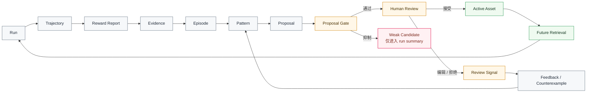
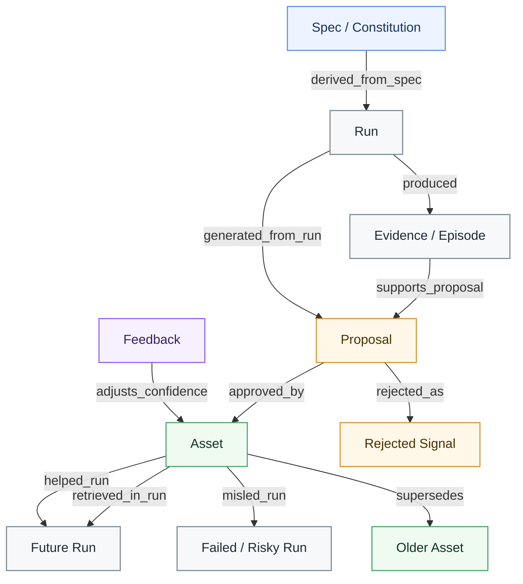

# Praxile

<div align="center">

<!-- 可选：发布后替换为项目 Logo。 -->
<!--  -->

<h3>面向 AI 编程的可治理经验 Harness</h3>

<p>
  <b>Spec 治理意图，Praxile 治理经验。</b>
</p>

<p>
  采集 Coding Agent 实际做过什么，将每次运行转化为<b>有证据支撑</b>、<b>可审查</b>的 proposal，<br />
  并只把经过审批的仓库本地知识写入 <code>.praxile/</code>。
</p>

<p>
  <b>简体中文</b>
  ·
  <a href="./README.md"><b>English</b></a>
</p>

<p>
  
  
  
  
</p>

</div>

---

## Praxile 是什么？

**Praxile** 是一个面向 AI 编程的可治理经验 Harness。

它围绕 Coding Agent 的工作过程运行：记录环境交互，构建 trajectory，计算 reward 与风险信号，提取 evidence，生成可审查 proposal，并且只在人工审批后写入长期仓库知识。

Praxile **不是**另一个通用 Coding Agent，**不是**隐藏式全局记忆系统，也**不是** Spec Kit 的替代品。

它面向希望长期使用 AI Coding Agent 的团队和开发者：让 Agent 工作流随着使用逐步积累可复用经验，同时不失去对“项目到底应该记住什么”的控制权。

> Spec-Driven Development 治理编码前 Agent 应该构建什么；Praxile 治理编码后项目应该学到什么。

---

## 为什么需要 Praxile？

大多数 Coding Agent 已经可以编辑文件、调用工具、运行测试。

更难的问题是：**一次任务结束后，什么应该成为长期项目知识？**

| 问题 | 常见 Coding Agent 工作流 | 使用 Praxile |
|---|---|---|
| 项目经验 | 每次运行后丢失 | 采集为有证据支撑的仓库经验 |
| 长期记忆 | 隐藏式或自动写入 | proposal 驱动，人工审批 |
| 重复失败 | 依赖人工重新发现 | 转化为有范围约束的 failure pattern |
| 项目规则 | 混在 prompt 里 | 沉淀为仓库本地治理资产 |
| Spec 对齐 | 依赖人工感觉 | Spec context 可影响 reward 与 proposal quality |
| 静默失败 | 难以及时发现 | 风险信号标记看似成功但验证薄弱的运行 |
| 可解释性 | 难以追踪 | `praxile explain latest` 展示检索、reward 和 proposal |
| 治理 | 零散且手工 | 审计、回滚、生命周期状态与来源关系图 |

Praxile 将经验沉淀链路显式化：

```text
User Task
  -> Environment Interaction
  -> Trajectory
  -> Reward Report
  -> Evidence / Episodes
  -> Experience Proposals
  -> Human Review
  -> Approved Repository Asset
  -> Future Retrieval
```

---

## Architecture at a glance

```mermaid
flowchart LR
    classDef input fill:#EEF4FF,stroke:#5B8DEF,color:#16325C,stroke-width:1.5px;
    classDef interface fill:#F6F8FA,stroke:#7B8794,color:#1F2937,stroke-width:1.5px;
    classDef runtime fill:#F3F7FF,stroke:#4F7FD9,color:#102A56,stroke-width:1.5px;
    classDef engine fill:#F7F0FF,stroke:#8B5CF6,color:#352063,stroke-width:1.5px;
    classDef gov fill:#FFF7E8,stroke:#D8942A,color:#4A3200,stroke-width:1.5px;
    classDef asset fill:#EFFAF0,stroke:#45A66A,color:#12351F,stroke-width:1.5px;
    classDef audit fill:#F2F4F7,stroke:#667085,color:#182230,stroke-width:1.5px;

    U["User Task<br/>反馈"]:::input
    S["Spec Context<br/>spec.md · plan.md · tasks.md · constitution.md"]:::input

    U --> I["Interfaces<br/>CLI · Terminal · Gateway"]:::interface
    S --> I

    I --> R["Runtime Harness<br/>Task Analyzer · Model Router · Tools · Tests · Safety · Workspace"]:::runtime
    R --> T["Trajectory Ledger<br/>Actions · Observations · Diffs · Commands · Artifacts"]:::runtime
    T --> E["Experience Engine<br/>Reward · Evidence · Episodes · Patterns"]:::engine
    E --> G["Governance Layer<br/>Silent-Failure Signals · Proposal Gate · Human Review"]:::gov
    G --> A["Repository Assets<br/>Memory · Skill · Rule · Eval · Pattern · Boundary"]:::asset
    A --> Q["Future Retrieval<br/>Explain · Attribution · Consolidation"]:::asset
    Q --> R

    G --> O["Audit & Provenance<br/>Graph · Redaction · CI Gates · Rollback"]:::audit
    A --> O
    T --> O
```



Praxile 由多层组成：

1. **Spec 与任务输入层**：描述意图、边界和验收标准；
2. **Runtime Harness 层**：通过受控工具、测试、安全策略和可选 workspace isolation 执行任务；
3. **Trajectory Ledger 层**：记录实际发生了什么；
4. **Experience Engine 层**：将运行转化为 reward、evidence、episode 和 pattern；
5. **Governance Layer 层**：通过 silent-failure detection、proposal gate 和人工 review 过滤经验；
6. **Repository Assets 层**：只有通过审批的内容才成为长期资产；
7. **Audit & Provenance 层**：让经验链路可解释、可脱敏导出、可回滚。

---

## Core loop



核心规则很简单：

> 一次运行可以产生学习信号，但只有经过审批的 proposal 才能成为长期仓库知识。

---

## 功能亮点

- **仓库本地经验**  
  Memories、skills、rules、evals、failure patterns、project patterns、frozen boundaries、architecture gates 等都保存在 `.praxile/` 下。

- **Spec-aware execution**  
  可选读取 spec、plan、task、constitution 上下文，并影响 reward、silent-failure signals 与 proposal gate。

- **Evidence-backed proposals**  
  长期变更以 proposal 形式生成，包含 source run、evidence summary、confidence、applicability scope、anti-scope 和 rollback path。

- **Silent-failure detection**  
  识别看似成功但验证薄弱、范围过大、缺少 spec 或缺少归因的运行风险。

- **Reward and attribution**  
  区分任务成功、回归安全、过程安全、成本、经验价值、用户反馈和 asset attribution。

- **Experience graph and audit chain**  
  从 spec、run、proposal、asset、feedback 和 future retrieval 中构建可重建的本地来源关系图。

- **Safety and rollback**  
  内置敏感路径保护、危险命令阻断、备份、architecture gate、workspace isolation 和 proposal rollback。

---

## Experience graph

Praxile 不只是一组 Markdown 文件。它会构建本地 provenance graph，用于解释经验从哪里来，以及后来如何被使用。



它帮助回答：

```text
这条 asset 来自哪里？
哪个 run 生成了这个 proposal？
哪些 evidence 支撑了它？
它是被接受、拒绝、废弃还是替换？
它后来在哪些 run 中被检索？
它是帮助了任务，还是误导了任务？
```

---

## 安装

Praxile 需要 **Python 3.11+**。

### 从 GitHub 安装

```bash
pipx install "git+https://github.com/Praxile-Alpha/Praxile.git"
```

或使用 `uv`：

```bash
uv tool install "git+https://github.com/Praxile-Alpha/Praxile.git"
```

### 开发环境安装

```bash
git clone https://github.com/Praxile-Alpha/Praxile.git
cd Praxile
python -m pip install -e ".[http]"
```

可选扩展：

```bash
python -m pip install -e ".[vector]"   # 语义检索
python -m pip install -e ".[browser]"  # 浏览器证据采集
python -m playwright install chromium
```

---

## 不配置模型也可以试用

运行本地 demo：

```bash
praxile demo --fast --accept-first --show-files
```

该 demo 不需要模型端点。它会创建一个小型项目，记录 trajectory，生成 reward report 和 proposals，在 demo 项目内接受一个低风险 memory，并展示后续运行如何检索它。

---

## 快速开始

### 1. 初始化代码仓库

```bash
cd /path/to/your/code-project
praxile init
praxile setup
praxile doctor
praxile doctor --online
```

`praxile setup` 用于配置 provider 和 model roles。Praxile 只保存环境变量名称，例如 `OPENAI_API_KEY` 或 `OLLAMA_API_KEY`，不会保存原始 API key。

### 2. 执行任务

```bash
praxile run "Fix the failing parser test" --test-command "python -m pytest"
```

### 3. 附加 spec context 执行

```bash
praxile run "Implement search API" \
  --spec docs/specs/search.md \
  --test-command "python -m pytest"
```

### 4. 审查与解释

```bash
praxile review --interactive
praxile explain latest
praxile spec verify latest
```

### 5. 接受或拒绝 proposal

```bash
praxile accept <PROPOSAL_ID>
praxile reject <PROPOSAL_ID> --reason "too broad"
```

---

## 经验模型

| 层级 | 作用 |
|---|---|
| Markdown / JSON | 人类可读的长期资产和结构化运行记录 |
| SQLite | 资产元数据、生命周期状态、使用记录和来源关系 |
| FTS | 关键词检索 |
| Vector index | 可选语义检索 |
| Experience graph | 可重建的来源关系与影响关系 |
| Proposal history | 审查、接受、拒绝、回滚记录 |
| Audit chain | 带脱敏模式的可导出治理证据 |

已批准资产默认处于 active 状态。Deprecated、superseded、archived 资产仍然可审计，但默认不参与正常检索。

---

## 常用命令

```text
praxile init                    初始化当前仓库的 .praxile
praxile setup                   配置 providers 和 model roles
praxile demo --fast             运行本地 governed-experience demo
praxile run "..."               执行 agent 任务
praxile run "..." --dry-run     仅分析并记录，不编辑文件
praxile run "..." --spec ...    附加 spec context 执行任务
praxile review --interactive    审查 pending proposals
praxile explain latest          解释检索、reward 和 proposals
praxile spec check              检查可选 spec 质量信号
praxile spec verify latest      基于 spec context 验证运行结果
praxile graph explain <ASSET>   解释 asset 来源与使用关系
praxile audit check             运行治理门禁
praxile consolidate --all       对重复或过期资产生成治理 proposal
praxile rollback <ID>           回滚任务编辑或已接受 proposal
praxile doctor --online         校验配置、路由和本地状态
```

完整 CLI 参考请见 [Getting Started](docs/GETTING_STARTED.md)。

---

## 本地状态

Praxile 会在 `.praxile/` 下写入仓库本地状态：

```text
.praxile/
  config.json
  constitution.md
  memory/
  skills/
  evals/
  rules/
  experience/
    trajectories/
    evidence/
    episodes/
    patterns/
    proposals/
    feedback/
  backups/
  db/
  logs/
```

不要把原始密钥写入 `.praxile/config.json`。请通过 `api_key_env` 和 channel 的 `token_env` 设置引用环境变量。

---

## Interop boundary

Praxile 可以检测可选的外部 Agent 能力，也可以使用 OpenAI-compatible endpoints，但它不是 Hermes 或 OpenClaw 插件。

- `.praxile/memory` 不会写入外部全局记忆；
- `.praxile/skills` 不会安装到外部 skill store；
- Praxile trajectories 是事实来源；
- external-compatible sidecars 只是导出物；
- 未来的外部同步必须通过显式 adapter 命令和可审计 proposal 完成。

---

## 当前状态

Praxile 当前处于 **Alpha** 阶段。

已实现核心能力：

- init / setup / doctor；
- 本地 demo；
- run / trajectory logging；
- reward report；
- evidence 和 proposal generation；
- proposal gate；
- review / accept / reject；
- repository-local assets；
- retrieval 和 explain；
- spec-aware context；
- silent-failure signals；
- experience graph 和 audit exports；
- rollback。

演进中能力：

- isolated workspaces；
- terminal 与 local gateway；
- channel configuration；
- semantic judges；
- CI governance gates；
- advanced consolidation。

首个版本不包含：

- 自动模型权重训练；
- marketplace 分发；
- 静默全局记忆同步；
- 自动生产级 Telegram / Discord listeners；
- 不受限制的 shell 执行；
- 长期经验的自动接受。

---

## 文档

- [Getting Started](docs/GETTING_STARTED.md)
- [Configuration](docs/CONFIGURATION.md)
- [Architecture](docs/ARCHITECTURE.md)
- [Core Layers](docs/CORE_LAYERS.md)
- [Experience Model](docs/EXPERIENCE_MODEL.md)
- [Why Praxile](docs/WHY_PRAXILE.md)
- [Audit Governance](docs/audit-governance.md)
- [Install And Interop](docs/INSTALL_AND_INTEROP.md)
- [Testing Guide](docs/contributing-testing.md)
- [Security Policy](SECURITY.md)

---

## 参与贡献

欢迎贡献。

适合作为起点的方向包括：

- proposal quality 与 deduplication；
- spec-aware experience；
- silent-failure detection；
- retrieval quality；
- semantic judge evaluation；
- explainability；
- audit 与 governance UX。

提交前请阅读 `CONTRIBUTING.md` 与 `SECURITY.md`。

---

## License

MIT License. See [LICENSE](LICENSE).
