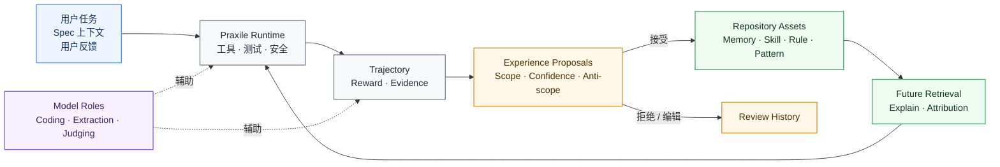
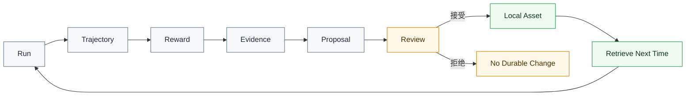

# Praxile

<div align="center">

<!-- 可选：发布后替换为项目 Logo。 -->

<!--  -->

<h3>面向 AI 编程的可治理经验 Harness</h3>

<p>
  <b>Spec 治理意图，Praxile 治理经验。</b>
</p>

<p>
  将 AI Coding Agent 的运行过程转化为<b>有证据支撑</b>、<b>可审查</b>、仓库本地化的长期知识。
</p>

<p>
  <b>简体中文</b>
  ·
  <a href="./README.md"><b>English</b></a>
</p>

<p>
  
  
  
  
</p>

</div>

***

## Praxile 是什么？

**Praxile** 是一个面向 AI 编程的可治理经验 Harness。

它会采集 AI Coding Agent 在一次任务中实际做了什么，将运行过程转化为有证据支撑的 proposal，并且只把经过审批的经验沉淀为仓库本地知识，存放在 `.praxile/` 下。

Praxile **不是**通用 Coding Agent，**不是**隐藏式全局记忆系统，也**不是** Spec Kit 的替代品。

它是围绕 AI 编程过程的治理层，覆盖：

- 环境交互；
- 运行轨迹记录；
- 奖励与反馈；
- 证据提取；
- proposal 审查；
- 审计与回滚；
- 后续任务检索。

目标很简单：

> Coding Agent 不应该在每次任务中反复重新理解同一个仓库；但它也不应该不经审查地记住所有经验。

***

## 为什么需要 Praxile？

大多数 Coding Agent 已经可以编辑文件、调用工具、运行测试。

更难的问题是：**一次任务结束后，项目到底应该记住什么？**

如果缺少可治理的经验层，Coding Agent 工作流往往会变成：

| 问题   | 常见 Agent 工作流 | 使用 Praxile                           |
| ---- | ------------ | ------------------------------------ |
| 项目经验 | 每次运行后丢失      | 采集为有证据支撑的本地经验                        |
| 长期记忆 | 隐藏式或自动写入     | proposal 驱动，人工审批                     |
| 重复失败 | 依赖人工重新发现     | 转化为可复用 failure pattern               |
| 项目规则 | 混在 prompt 里  | 沉淀为有范围约束的仓库本地资产                      |
| 用户反馈 | 零散且容易丢失      | 进入 reward 与治理信号                      |
| 可解释性 | 难以追踪         | `praxile explain latest` 展示为什么加载某条经验 |
| 安全性  | 依赖 Agent 自觉  | 通过规则、审查门禁、回滚和审计约束                    |

Praxile 将经验沉淀链路显式化：

```text
User Task
  -> Environment Interaction
  -> Trajectory
  -> Reward Report
  -> Evidence / Episodes
  -> Experience Proposals
  -> Human Review
  -> Approved Repository Asset
  -> Future Retrieval
```

***

## 核心思想

### 1. 编码前用 Spec，编码后用经验治理

Spec-Driven Development 解决的是：在执行前定义 Agent 应该构建什么。

Praxile 关注的是执行之后发生了什么：

```text
Agent 尝试了什么？
产生了哪些证据？
哪些失败了？
哪些通过了？
哪些经验值得复用？
哪些内容必须经过审查才能成为长期知识？
```

一句话：

> Spec 治理意图，Praxile 治理经验。

### 2. 没有审查，就没有长期记忆

Praxile 不会静默改写长期记忆。

一次运行可以产生 evidence。Evidence 可以构成 episode。多个 episode 可以形成 pattern。Pattern 可以生成 proposal。

但只有经过 review 的内容，才会成为持久化的仓库知识。

### 3. Markdown-first，索引用于检索

Praxile 让长期资产保持可读、可审查、可版本管理。

- `.praxile/` 下的 Markdown / JSON 用于人工检查和长期保存；
- SQLite / FTS / 可选向量索引用于搜索和检索；
- 使用记录与反馈元数据用于归因和生命周期治理。

***

## 功能亮点

- **仓库本地经验**\
  Memories、skills、rules、evals、failure patterns、project patterns、frozen boundaries、architecture gates 等都保存在 `.praxile/` 下。
- **Proposal 驱动的演化机制**\
  长期经验更新先以 evidence-backed proposal 形式出现，并需要显式审查。
- **运行轨迹与 reward report**\
  Praxile 区分任务成功、回归安全、过程安全、成本、经验价值和用户反馈。
- **证据驱动的学习链路**\
  一次运行会被转化为 evidence、episode、pattern 和有范围约束的 proposal。
- **Spec-aware 工作流**\
  可选读取 `spec.md`、`plan.md`、`tasks.md`、`constitution.md`，用于影响 reward 和 proposal gate。
- **可解释检索**\
  Praxile 可以解释加载了哪些资产、为什么匹配、如何影响后续任务。
- **安全与回滚**\
  内置敏感路径保护、危险命令阻断、备份、architecture gate 和 proposal rollback。

***

## Architecture at a glance



***

## Core loop



***

## 安装

Praxile 需要 **Python 3.11+**。

### 从 GitHub 安装

```bash
pipx install "git+https://github.com/Praxile-Alpha/Praxile.git"
```

或使用 `uv`：

```bash
uv tool install "git+https://github.com/Praxile-Alpha/Praxile.git"
```

### 开发环境安装

```bash
git clone https://github.com/Praxile-Alpha/Praxile.git
cd Praxile
python -m pip install -e ".[http]"
```

可选扩展：

```bash
python -m pip install -e ".[vector]"   # 语义检索
python -m pip install -e ".[browser]"  # 浏览器证据采集
python -m playwright install chromium
```

***

## 不配置模型也可以试用

运行本地 demo：

```bash
praxile demo --fast --accept-first --show-files
```

该 demo 不需要模型端点。它会创建一个小型项目，记录 trajectory，生成 reward report 和 proposals，在 demo 项目内接受一个低风险 memory，并展示后续运行如何检索它。

***

## 快速开始

### 1. 初始化代码仓库

```bash
cd /path/to/your/code-project
praxile init
praxile setup
praxile doctor
praxile doctor --online
```

`praxile setup` 用于配置 provider 和 model roles。Praxile 只保存环境变量名称，例如 `OPENAI_API_KEY` 或 `OLLAMA_API_KEY`，不会保存原始 API key。

### 2. 执行任务

```bash
praxile run "Fix the failing parser test" --test-command "python -m pytest"
```

### 3. 审查 Praxile 学到了什么

```bash
praxile review --interactive
praxile explain latest
```

### 4. 接受或拒绝 proposal

```bash
praxile accept <PROPOSAL_ID>
praxile reject <PROPOSAL_ID> --reason "too broad"
```

***

## Spec-aware 工作流

当任务有明确意图、Non-Goals、验收标准或成功指标时，可以附加 spec 上下文：

```bash
praxile run "Implement search API"   --spec docs/specs/search.md   --test-command "python -m pytest"
```

然后基于 spec 验证运行结果：

```bash
praxile spec verify latest
```

即使一个任务通过了测试，如果它违反 scope、跳过 acceptance criteria，或在没有 gate 的情况下修改架构，仍可能产生低质量或被阻断的 experience proposal。

***

## 经验模型

Praxile 的经验既不只是 Markdown，也不只是 Graph。

| 层级               | 作用                     |
| ---------------- | ---------------------- |
| Markdown / JSON  | 人类可读的长期资产和结构化运行记录      |
| SQLite           | 资产元数据、生命周期状态、使用记录和来源关系 |
| FTS              | 关键词检索                  |
| Vector index     | 可选语义检索                 |
| Proposal history | 审查、接受、拒绝、回滚记录          |
| Audit chain      | 解释资产从哪里来，以及如何被使用       |

已批准资产默认处于 active 状态。Deprecated、superseded、archived 资产仍然可审计，但默认不参与正常检索。

***

## 常用命令

```text
praxile init                    初始化当前仓库的 .praxile
praxile setup                   配置 providers 和 model roles
praxile demo --fast             运行本地 governed-experience demo
praxile run "..."               执行 agent 任务
praxile run "..." --dry-run     仅分析并记录，不编辑文件
praxile review --interactive    审查 pending proposals
praxile explain latest          解释检索、reward 和 proposals
praxile feedback latest ...     添加显式反馈
praxile spec check              检查可选 spec 质量信号
praxile spec verify latest      基于 spec context 验证运行结果
praxile consolidate --all       对重复或过期资产生成治理 proposal
praxile audit check             运行治理门禁
praxile rollback <ID>           回滚任务编辑或已接受 proposal
praxile doctor --online         校验配置、路由和本地状态
```

完整 CLI 参考请见 [Getting Started](docs/GETTING_STARTED.md)。

***

## 本地状态

Praxile 会在 `.praxile/` 下写入仓库本地状态：

```text
.praxile/
  config.json
  constitution.md
  memory/
  skills/
  evals/
  rules/
  experience/
    trajectories/
    evidence/
    episodes/
    patterns/
    proposals/
    feedback/
  backups/
  db/
  logs/
```

不要把原始密钥写入 `.praxile/config.json`。请通过 `api_key_env` 和 channel 的 `token_env` 设置引用环境变量。

***

## Interop boundary

Praxile 可以检测可选的外部 Agent 能力，也可以使用 OpenAI-compatible endpoints，但它不是 Hermes 或 OpenClaw 插件。

- `.praxile/memory` 不会写入外部全局记忆；
- `.praxile/skills` 不会安装到外部 skill store；
- Praxile trajectories 是事实来源；
- external-compatible sidecars 只是导出物；
- 未来的外部同步必须通过显式 adapter 命令和可审计 proposal 完成。

***

## 当前状态

Praxile 当前处于 **Alpha** 阶段。

已实现核心链路：

- init / setup / doctor；
- 本地 demo；
- run / trajectory logging；
- reward report；
- evidence 和 proposal generation；
- review / accept / reject；
- repository-local assets；
- retrieval 和 explain；
- rollback。

实验性或演进中能力：

- spec-aware workflow；
- experience indexing 与 provenance graph；
- audit exports；
- isolated workspaces；
- terminal 与 local gateway；
- channel configuration；
- semantic judges。

首个版本不包含：

- 自动模型权重训练；
- marketplace 分发；
- 静默全局记忆同步；
- 自动生产级 Telegram / Discord listeners；
- 不受限制的 shell 执行；
- 长期经验的自动接受。

***

## 文档

- [Getting Started](docs/GETTING_STARTED.md)
- [Configuration](docs/CONFIGURATION.md)
- [Architecture](docs/ARCHITECTURE.md)
- [Experience Model](docs/EXPERIENCE_MODEL.md)
- [Why Praxile](docs/WHY_PRAXILE.md)
- [Audit Governance](docs/audit-governance.md)
- [Install And Interop](docs/INSTALL_AND_INTEROP.md)
- [Testing Guide](docs/contributing-testing.md)
- [Security Policy](SECURITY.md)

***

## 参与贡献

欢迎贡献。

适合作为起点的方向包括：

- proposal quality 与 deduplication；
- spec-aware experience；
- retrieval quality；
- semantic judge evaluation；
- explainability；
- audit 与 governance UX。

提交前请阅读 `CONTRIBUTING.md` 与 `SECURITY.md`。

***

## License

MIT License. See [LICENSE](LICENSE).
