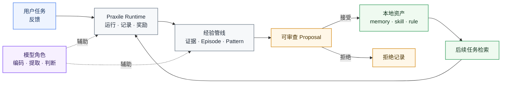
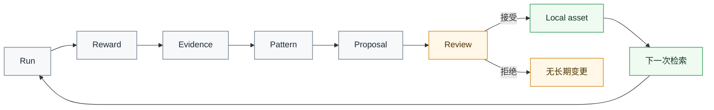

# Praxile

<div align="center">

<!-- 发布后可替换为项目 Logo。 -->
<!--  -->

<h3>面向 Coding Agent 的可治理本地经验层</h3>

<p>
将 coding agent 的运行过程沉淀为<b>可审查</b>、<b>可复用</b>、仓库本地化的经验资产。
</p>

<p>
  <b>简体中文</b>
  ·
  <a href="./README.md"><b>English</b></a>
</p>

<p>
  
  
  
  
</p>

</div>

---

## 为什么需要 Praxile？

Coding agent 可以改代码、跑工具、完成任务。  
但一次运行中学到的大量项目经验，往往会在任务结束后消失。

**Praxile** 为每个代码仓库增加一层可治理的经验系统：

- 记录 agent 运行过程；
- 从轨迹、工具结果和用户反馈中提取证据；
- 将重复出现的经验转化为可审查 proposal；
- 只把通过审批的经验写入 `.praxile/`；
- 在后续任务中检索并复用这些本地经验。

Praxile 不是模型训练框架，也不是隐藏式记忆系统，更不是完全自治的 coding agent。  
它是一个 **agent harness**，用于让仓库级经验变得安全、可控、可复用。

---

## Praxile 带来什么？

| 需求 | Praxile 的做法 |
|---|---|
| 复用项目知识 | 沉淀本地 memories、skills、rules 和 failure patterns |
| 保持人类控制 | 采用 proposal 驱动机制，长期经验需要用户审批 |
| 解释运行过程 | `praxile explain latest` 展示加载了哪些经验、生成了哪些提案 |
| 利用用户反馈 | 正负反馈进入 reward 与 proposal confidence 链路 |
| 降低模型浪费 | 支持模型角色分工，本地模型可承担 semantic judge |
| 保持数据本地化 | 所有状态保存在仓库 `.praxile/` 目录下 |

---

## 快速开始

### 1. 从源码安装

```bash
git clone https://github.com/<your-org>/praxile.git
cd praxile
python -m pip install -e .
```

开发环境：

```bash
python -m pip install -e ".[dev]"
```

可选扩展：

```bash
python -m pip install -e ".[http]"     # HTTP gateway
python -m pip install -e ".[vector]"   # vector retrieval
python -m pip install -e ".[browser]"  # browser evidence capture
python -m playwright install chromium
```

### 2. 运行本地 Demo

```bash
praxile demo --fast --accept-first
```

### 3. 初始化仓库

```bash
cd /path/to/your/project
praxile init
praxile setup
praxile doctor --online
```

### 4. 执行任务

```bash
praxile run "Fix the failing parser test" --test-command "python -m pytest"
```

### 5. 审查本次学习结果

```bash
praxile review --interactive
praxile explain latest
```

### 6. 提供反馈

```bash
praxile feedback latest --positive "Good fix. The scope was correct."
praxile feedback prop_123 --negative "This proposal is too generic."
```

---

## Architecture at a glance



---

## Core loop



---

## 核心概念

| 概念 | 含义 |
|---|---|
| Trajectory | 一次运行中实际发生了什么 |
| Evidence | 从运行轨迹中提取出的结构化事实 |
| Episode | 可学习的运行片段 |
| Pattern | 多次运行中反复出现的项目经验 |
| Proposal | 等待用户审查的长期变更提案 |
| Asset | 已通过审批的 memory、skill、rule 或 failure pattern |

---

## 常用命令

```text
praxile init                 初始化当前仓库的 .praxile
praxile setup                配置 provider 与 model roles
praxile demo --fast          运行本地自进化 Demo
praxile run "..."            执行 agent 任务
praxile review --interactive 审查待处理 proposal
praxile explain latest       解释检索、奖励与 proposal 来源
praxile feedback latest ...  添加用户反馈
praxile doctor --online      检查配置与本地状态
```

---

## 本地状态

Praxile 会把仓库本地状态写入 `.praxile/`。

```text
.praxile/
  config.json
  memory/
  skills/
  rules/
  experience/
    evidence/
    episodes/
    patterns/
    proposals/
    feedback/
  db/
  logs/
  backups/
```

---

## 安全边界

Praxile 围绕“可治理演化”设计。

它会：

- 记录运行轨迹；
- 计算 reward report；
- 提取证据与模式；
- 生成可审查 proposal；
- 检索已批准的本地经验；
- 纳入用户显式反馈。

它不会：

- 微调模型；
- 静默改写长期记忆；
- 自动批准项目规则；
- 将项目知识导出到隐藏的全局记忆；
- 替代人工审查。

---

## 项目状态

Praxile 当前处于 **alpha** 阶段。

已可用：

- repository-local experience
- proposal-driven evolution
- hybrid reward
- user feedback loop
- model roles
- semantic judges
- pattern mining
- asset lifecycle governance

实验性能力：

- HTTP gateway
- browser adapter
- production hardening

---

## 文档

建议继续阅读：

- `docs/GETTING_STARTED.md`
- `docs/ARCHITECTURE.md`
- `docs/CONFIGURATION.md`
- `docs/STATE_LAYOUT.md`
- `docs/experience-governance.md`
- `docs/proposal-decision-guide.md`

---

## 参与贡献

欢迎贡献。

建议优先关注：

- model-role 易用性
- retrieval quality
- semantic-judge evaluation
- proposal review UX
- explainability
- experience governance

提交前请先阅读 `CONTRIBUTING.md` 与 `SECURITY.md`。

---

## License

MIT License. See [LICENSE](LICENSE).
