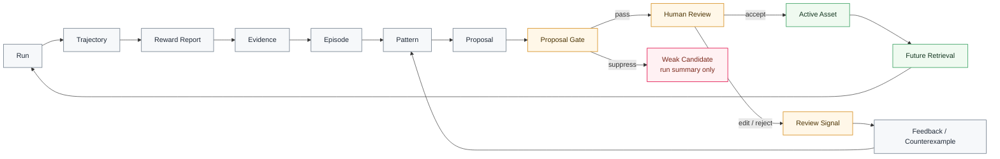
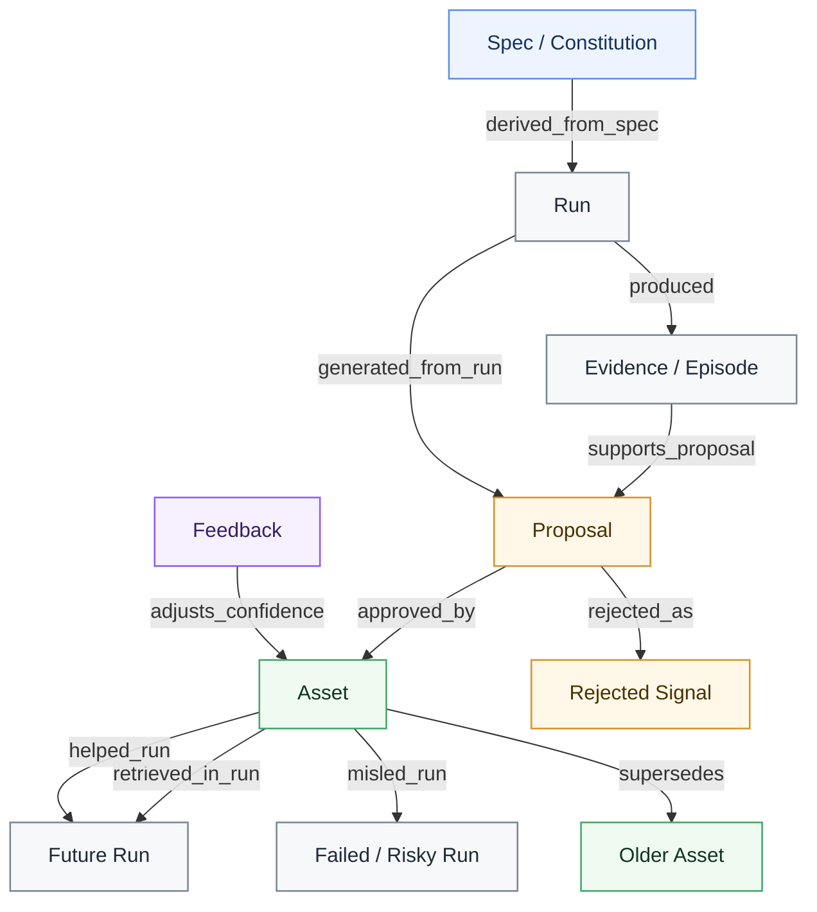
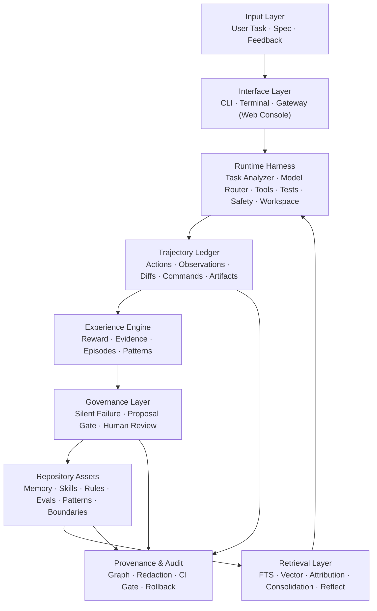

# Praxile Architecture Diagrams

This document contains the redesigned architecture diagrams used by the README.

---

## 1. Architecture at a glance

```mermaid
flowchart LR
    classDef input fill:#EEF4FF,stroke:#5B8DEF,color:#16325C,stroke-width:1.5px;
    classDef interface fill:#F6F8FA,stroke:#7B8794,color:#1F2937,stroke-width:1.5px;
    classDef runtime fill:#F3F7FF,stroke:#4F7FD9,color:#102A56,stroke-width:1.5px;
    classDef engine fill:#F7F0FF,stroke:#8B5CF6,color:#352063,stroke-width:1.5px;
    classDef gov fill:#FFF7E8,stroke:#D8942A,color:#4A3200,stroke-width:1.5px;
    classDef asset fill:#EFFAF0,stroke:#45A66A,color:#12351F,stroke-width:1.5px;
    classDef audit fill:#F2F4F7,stroke:#667085,color:#182230,stroke-width:1.5px;

    U["User Task<br/>feedback"]:::input
    S["Spec Context<br/>spec.md · plan.md · tasks.md · constitution.md"]:::input

    U --> I["Interfaces<br/>CLI · Terminal · Gateway"]:::interface
    S --> I

    I --> R["Runtime Harness<br/>task analyzer · model router · tools · tests · safety · workspace"]:::runtime
    R --> T["Trajectory Ledger<br/>actions · observations · diffs · commands · artifacts"]:::runtime
    T --> E["Experience Engine<br/>reward · evidence · episodes · patterns"]:::engine
    E --> G["Governance Layer<br/>silent-failure signals · proposal gate · human review"]:::gov
    G --> A["Repository Assets<br/>memory · skill · rule · eval · pattern · boundary"]:::asset
    A --> Q["Future Retrieval<br/>explain · attribution · consolidation"]:::asset
    Q --> R

    G --> O["Audit & Provenance<br/>graph · redaction · CI gates · rollback"]:::audit
    A --> O
    T --> O
```

---

## 2. Core governed experience loop

---

## 3. Experience graph / provenance graph

---

## 4. Layer model

